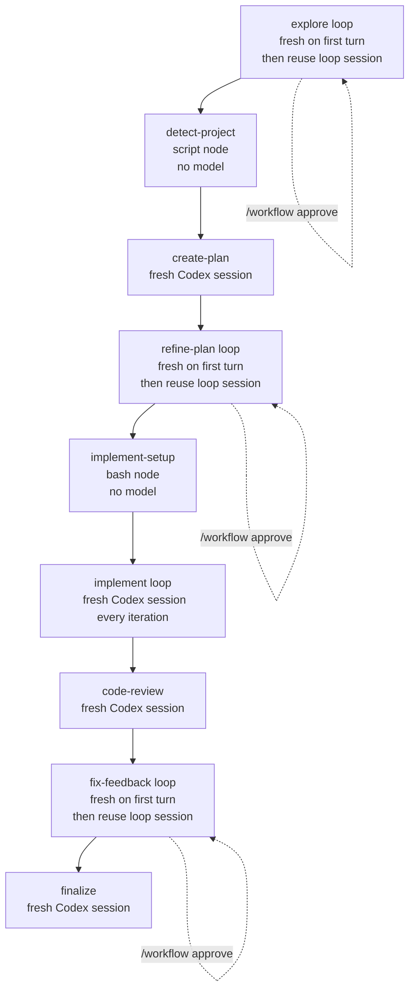

# archon-piv-loop-codex

This is a companion note for [`archon-piv-loop-codex.yaml`](./archon-piv-loop-codex.yaml).

It answers one specific operational question: when the workflow keeps model context,
when it starts a fresh Codex thread, and where human approval pauses/resumes happen.

## Short answer

The workflow is **not** one single context window from start to finish.

It is one workflow run, but it executes as a series of nodes:

- some nodes are **non-AI** (`script` / `bash`) and invoke no model
- some nodes are **fresh Codex sessions**
- some nodes are **interactive loops** that keep their own loop session across
  iterations
- the `implement` loop is intentionally **fresh every iteration**

## Source of truth

The behavior below is grounded in:

- [`archon-piv-loop-codex.yaml`](./archon-piv-loop-codex.yaml)
- [`packages/workflows/src/dag-executor.ts`](../../../packages/workflows/src/dag-executor.ts)
- [`packages/workflows/src/schemas/loop.ts`](../../../packages/workflows/src/schemas/loop.ts)
- [`packages/core/src/clients/codex.ts`](../../../packages/core/src/clients/codex.ts)

## Context model

Two different things matter:

1. **Workflow run**
   One Archon workflow record spanning the whole PIV process.
2. **Codex session/thread**
   The actual model conversation context used for a node or loop iteration.

The workflow run is continuous. The Codex thread is not.

## Phase-by-phase session behavior

| Phase | Node | Model invocation | Context behavior |
|------|------|------------------|------------------|
| Explore | `explore` | Codex loop | Fresh on iteration 1, then reuses the loop session across approval/feedback rounds |
| Detect | `detect-project` | None | `script` node, no model |
| Plan | `create-plan` | Codex prompt node | Fresh session because `context: fresh` |
| Plan refine | `refine-plan` | Codex loop | Fresh on iteration 1, then reuses the loop session across review rounds |
| Implement setup | `implement-setup` | None | `bash` node, no model |
| Implement | `implement` | Codex loop | Fresh session every iteration because `fresh_context: true` |
| Code review | `code-review` | Codex prompt node | Fresh session because `context: fresh` |
| Fix feedback | `fix-feedback` | Codex loop | Fresh on iteration 1, then reuses the loop session across feedback rounds |
| Finalize | `finalize` | Codex prompt node | Fresh session because `context: fresh` |

## Where context is reset

These are the explicit reset points in the YAML:

- `create-plan` sets `context: fresh`
- `implement` sets `loop.fresh_context: true`
- `code-review` sets `context: fresh`
- `finalize` sets `context: fresh`

These are the implicit loop reset rules enforced by the executor:

- every loop starts with a fresh session on **iteration 1**
- later loop iterations reuse the loop's saved session unless
  `loop.fresh_context: true`

That means:

- `explore`, `refine-plan`, and `fix-feedback` keep loop-local context after the
  first turn
- `implement` does not; each task iteration is a fresh Codex thread

## Flow

## What the executor actually does

### Prompt and command nodes

For normal AI nodes, the DAG executor decides whether to reuse a prior session:

- if the node is in a parallel layer, it is fresh
- if the node has `context: fresh`, it is fresh
- otherwise it can inherit the last sequential session

In this workflow, the prompt nodes that matter are already marked fresh where a
reset is desired, so they do not inherit prior prompt-node context.

### Loop nodes

Loop nodes are handled on a separate execution path. They do **not** use the
same sequential-session logic as normal prompt nodes.

Instead:

- iteration 1 is always fresh
- later iterations reuse the loop's `currentSessionId`
- unless `fresh_context: true`, in which case every iteration is fresh

This is why `implement` behaves differently from `explore`, `refine-plan`, and
`fix-feedback`.

### Interactive pauses

When an interactive loop does not emit its completion signal:

1. Archon pauses the workflow run
2. stores loop metadata including the current loop `sessionId`
3. waits for `/workflow approve <run-id> <feedback>`
4. resumes the loop on the next iteration with that feedback in
   `$LOOP_USER_INPUT`

This is a workflow pause/resume, not a whole-workflow context reset.

## Important nuance on resume

There are two resume cases:

1. **Resume inside an interactive loop**
   The loop can continue with the saved loop `sessionId`, unless that loop is
   configured to force fresh iterations.
2. **Resume a prior DAG run more generally**
   Archon can skip already-completed nodes, but the executor explicitly warns
   that prior-node AI session context is not restored automatically.

So "resume workflow" does not mean "restore one giant conversation across all
phases."

## Why implement is intentionally fresh

The implement loop prompt explicitly says the agent is in a **fresh session**
with no memory of previous iterations and must re-read the plan, progress, git
state, and files from disk.

That makes task execution more deterministic:

- one task per iteration
- less context drift across tasks
- each task grounded in repo state and artifacts, not remembered chat state

## Practical takeaway

If you are reasoning about this workflow operationally:

- treat **disk artifacts and repo state** as the durable memory
- treat **loop-local session reuse** as available only inside `explore`,
  `refine-plan`, and `fix-feedback`
- treat **implement** as stateless between task iterations except for what it
  re-reads from disk
- treat `create-plan`, `code-review`, and `finalize` as clean-session nodes
