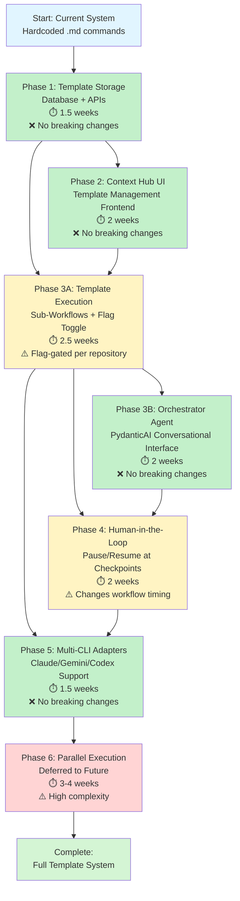
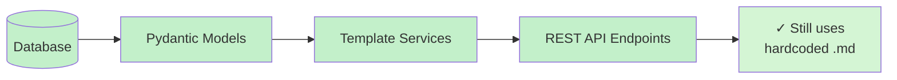
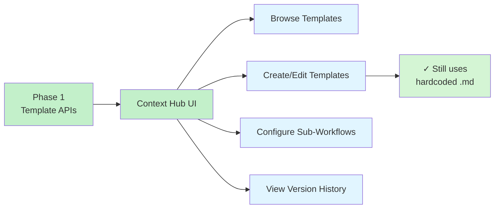
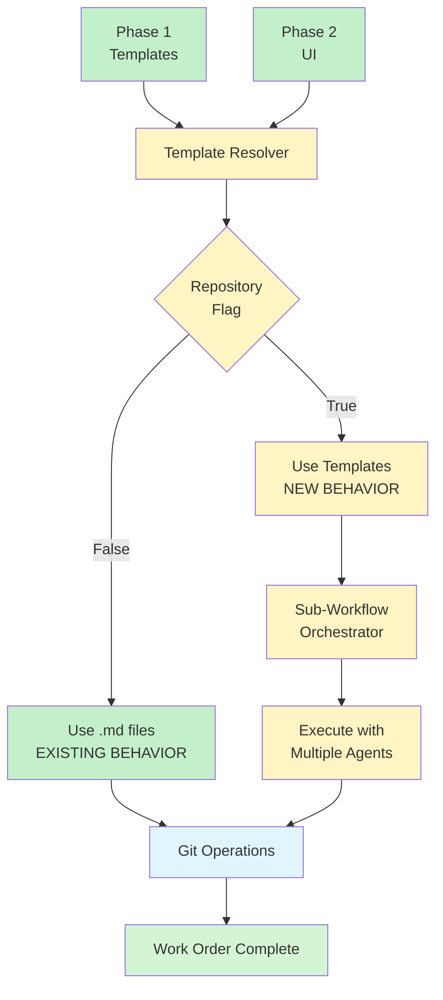
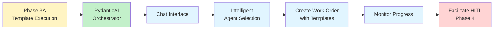
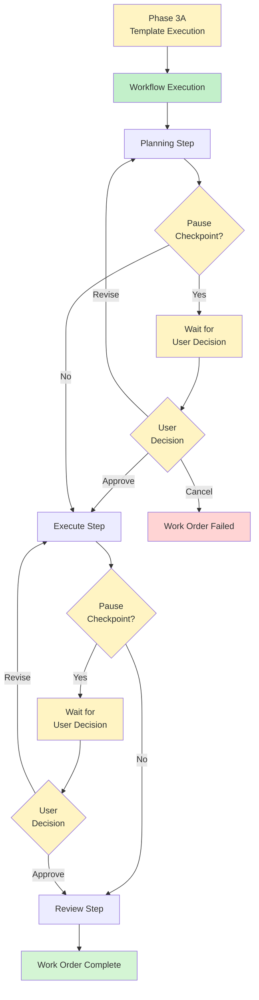
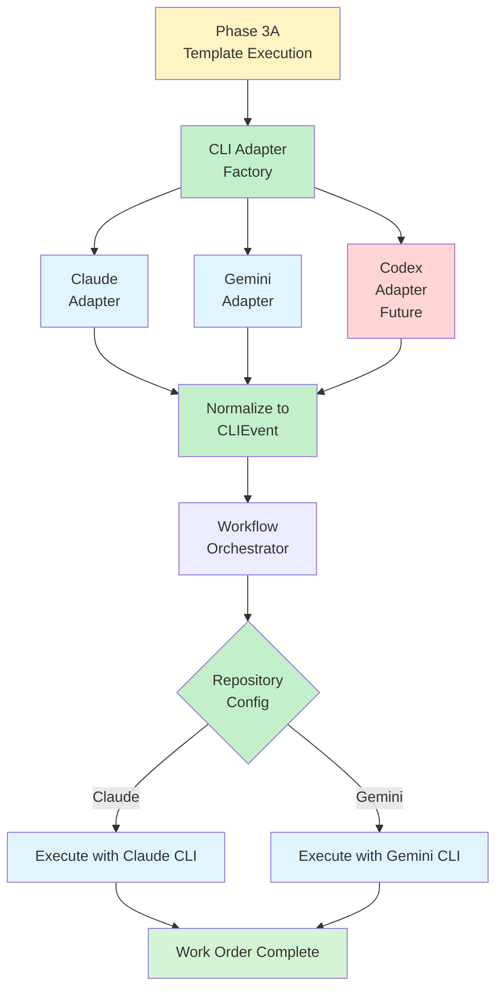
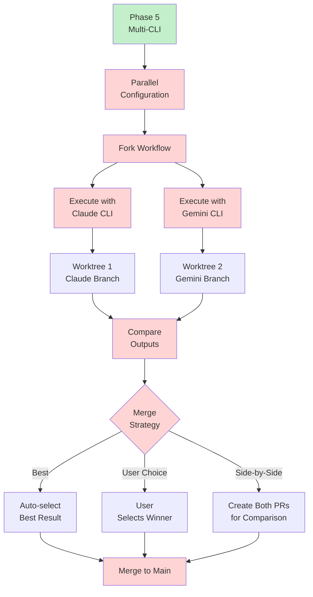
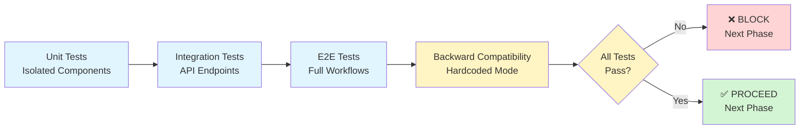

# Agent Work Orders - Phase Dependency Diagram

## Visual Flow Chart



## Phase Breakdown

### Legend
- 🟢 Green: No breaking changes, additive only
- 🟡 Yellow: Breaking changes but flag-gated/controlled
- 🔴 Red: High complexity, deferred to future

---

## Phase 1: Template Storage System
**Duration**: 1.5 weeks | **Risk**: Low | **Breaking**: ❌ None



**Deliverables**:
- ✅ Database tables (agent_templates, step_templates, workflow_templates)
- ✅ CRUD APIs for templates
- ✅ Seed data mirroring hardcoded commands
- ✅ Versioning system

**Validation**: Create work order → Still uses `.claude/commands/*.md` files

---

## Phase 2: Context Hub Frontend
**Duration**: 2 weeks | **Risk**: Low | **Breaking**: ❌ None



**Deliverables**:
- ✅ Agent Template Library view
- ✅ Step Template Library view (with sub-step builder)
- ✅ Workflow Builder UI
- ✅ Repository Configuration page

**Validation**: Create template via UI → Work orders still use hardcoded commands

---

## Phase 3A: Template Execution System (CRITICAL PATH)
**Duration**: 2.5 weeks | **Risk**: Medium | **Breaking**: ⚠️ Flag-gated



**Deliverables**:
- ✅ Template resolution engine
- ✅ Sub-workflow orchestrator (multi-agent support)
- ✅ Flag toggle per repository (`use_template_execution`)
- ✅ Backward compatibility (hardcoded mode remains default)

**Validation**:
1. Default repositories → Hardcoded .md files
2. Opt-in repositories → Template-based execution
3. Sub-workflows → Multiple agents collaborate on single step

**Core Steps** (configurable with templates):
- Planning (can have sub-steps)
- Execute (can have sub-steps)
- Review (can have sub-steps)

**Setup Steps** (always hardcoded):
- create-branch (git operation)
- commit (git operation)
- create-pr (GitHub API)

---

## Phase 3B: Orchestrator Agent
**Duration**: 2 weeks | **Risk**: Low | **Breaking**: ❌ None



**Deliverables**:
- ✅ PydanticAI conversational agent
- ✅ 7 orchestrator tools (create, monitor, pause, resume, etc.)
- ✅ Intelligent agent selection based on task analysis
- ✅ Chat panel UI integrated into AWO page

**Validation**: Chat: "Add authentication" → Recommends Python expert + Security reviewer → Creates work order with custom templates

---

## Phase 4: Human-in-the-Loop
**Duration**: 2 weeks | **Risk**: Medium | **Breaking**: ⚠️ Changes timing



**Deliverables**:
- ✅ Pause service (database-backed pause states)
- ✅ Workflow orchestrator pause/resume logic
- ✅ Configurable checkpoints in workflow templates (`pause_after: true`)
- ✅ PauseStateCard UI component with Approve/Revise/Cancel
- ✅ Polling-based (WebSocket deferred to future)

**Checkpoints**:
1. After Planning → Review and approve plan
2. After Execute → Decide if code review needed
3. After Review → Approve changes or request corrections

**Validation**: Workflow pauses at configured checkpoints → User reviews → Workflow continues or revises based on feedback

---

## Phase 5: Multi-CLI Adapter System
**Duration**: 1.5 weeks | **Risk**: Low | **Breaking**: ❌ None



**Deliverables**:
- ✅ CLIAdapter abstract base class
- ✅ Claude CLI adapter (stream-json parsing)
- ✅ Gemini CLI adapter (stream-json parsing)
- ✅ Adapter factory (provider selection)
- ✅ Event normalization (all CLIs → same event format)

**Scope**: Provider switching (Claude **OR** Gemini), not parallel execution (Claude **AND** Gemini)

**Validation**: Switch repository to Gemini → Work order executes with Gemini CLI → Same event structure as Claude

---

## Phase 6: Parallel CLI Execution (DEFERRED)
**Duration**: 3-4 weeks | **Risk**: High | **Breaking**: ⚠️ Complex



**Scope**: Execute multiple CLIs simultaneously, compare outputs, merge results

**Challenges**:
- Parallel worktree management
- Result comparison algorithms
- Conflict resolution
- Resource/cost management

**Decision**: Defer until Phases 1-5 proven stable

---

## Critical Path Analysis

```
Phase 1 (1.5w) → Phase 2 (2w) → Phase 3A (2.5w) → Phase 3B (2w) → Phase 4 (2w) → Phase 5 (1.5w)
                                      ↓
                                   CRITICAL

Total: 11.5 weeks for Phases 1-5
```

**Phase 3A is the critical path** - all subsequent phases depend on it.

**Parallelization Opportunities**:
- Phase 3B and Phase 4 can start simultaneously after Phase 3A
- Phase 5 can start after Phase 3A (doesn't need Phase 3B/4)

---

## Risk Heatmap

| Phase | Complexity | Risk | Breaking Changes | Testing Burden |
|-------|-----------|------|------------------|----------------|
| Phase 1 | Medium | 🟢 Low | None | Medium |
| Phase 2 | High | 🟢 Low | None | Medium |
| **Phase 3A** | **Very High** | 🟡 **Medium** | **Flag-gated** | **High** |
| Phase 3B | High | 🟢 Low | None | Medium |
| Phase 4 | High | 🟡 Medium | Changes timing | High |
| Phase 5 | Medium | 🟢 Low | None | Medium |
| Phase 6 | Very High | 🔴 High | Complex | Very High |

**Highest Risk**: Phase 3A (template execution system)
- Most complex
- Touches core orchestrator
- Potential for breaking existing workflows
- Requires extensive backward compatibility testing

**Mitigation**:
- Flag-gated rollout (`use_template_execution` per repository)
- Comprehensive test coverage (unit, integration, E2E)
- Extensive validation gates
- Backward compatibility tests in every phase

---

## Validation Strategy



**Mandatory Gates**:
1. **Syntax & Linting**: Zero errors (ruff, mypy, TypeScript)
2. **Unit Tests**: 80%+ coverage, all pass
3. **Integration Tests**: All API endpoints functional
4. **Backward Compatibility**: Existing workflows unaffected
5. **Performance**: No regressions in execution time

**Backward Compatibility Test** (every phase):
```bash
# Create work order
# Verify uses hardcoded .md files
# Verify no template errors
# Verify workflow completes
```

---

## Success Metrics

**Phase Completion Criteria**:
- ✅ All tasks in PRP completed
- ✅ All validation gates passed
- ✅ Zero critical bugs
- ✅ Documentation updated
- ✅ Backward compatibility verified

**Overall Project Success**:
- ✅ Users can create custom agent templates
- ✅ Users can build workflows with sub-steps
- ✅ Work orders execute using templates
- ✅ HITL checkpoints functional
- ✅ Multiple CLI providers supported
- ✅ Orchestrator provides intelligent recommendations
- ✅ Zero regressions in existing functionality
- ✅ < 5% failure rate in template-based executions

---

## Timeline Estimate

**Conservative Estimate** (with buffer):
- Phase 1: 2 weeks (1.5w + 0.5w buffer)
- Phase 2: 2.5 weeks (2w + 0.5w buffer)
- Phase 3A: 3 weeks (2.5w + 0.5w buffer) ← CRITICAL
- Phase 3B: 2.5 weeks (2w + 0.5w buffer)
- Phase 4: 2.5 weeks (2w + 0.5w buffer)
- Phase 5: 2 weeks (1.5w + 0.5w buffer)

**Total: 14.5 weeks (~3.5 months)**

**Optimistic Estimate** (if everything goes smoothly):
- Total: 11.5 weeks (~2.75 months)

**With Parallelization** (Phase 3B/4/5 overlap):
- Potential: 9-10 weeks (~2.5 months)

---

**Last Updated**: 2025-01-05
**Status**: Planning Complete, Ready for Phase 1
**Next Action**: Begin Phase 1 database migrations
