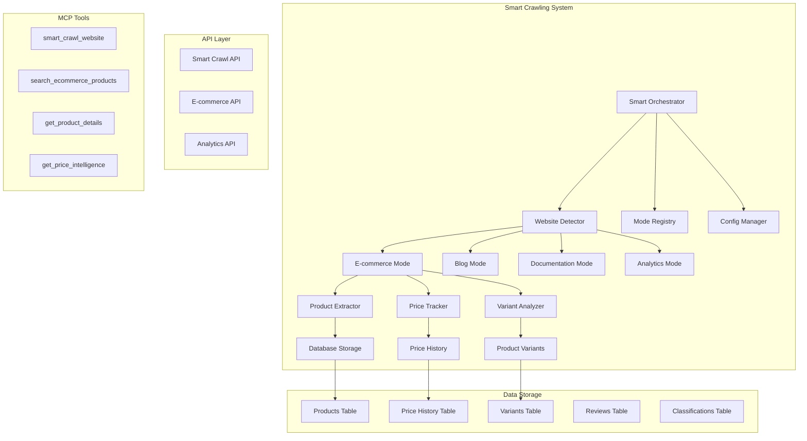

# 🚀 Smart Web Crawling System - Implementation Guide

## Overview

The Smart Web Crawling system is a comprehensive enhancement to Archon's existing crawling capabilities, providing specialized modes for different types of websites with advanced data extraction strategies. The system automatically detects website types and applies optimized crawling techniques for maximum data quality and relevance.

## 🎯 Key Features

### 1. **Automatic Website Detection**
- Intelligent analysis of HTML content, domain patterns, and metadata
- Multi-factor scoring system for accurate classification
- Confidence scoring and fallback mode recommendations
- Support for 10+ website types including e-commerce, blogs, documentation, analytics

### 2. **E-commerce Specialized Crawling**
- **Advanced Product Data Extraction**: Name, description, SKU, brand, categories
- **Comprehensive Pricing Intelligence**: Current prices, original prices, discounts, currency
- **Product Variant Support**: Size, color, style options with individual pricing
- **Review and Rating Extraction**: Customer reviews, ratings, helpful votes
- **Inventory Tracking**: Stock status, availability, quantity information
- **Media Collection**: Product images, videos with full URL resolution
- **Specification Parsing**: Technical specifications, features, attributes

### 3. **Price Intelligence & Competitive Analysis**
- Real-time price tracking with historical data
- Automated discount detection and calculation
- Brand comparison and market positioning analysis
- Price change alerts and trend analysis
- Competitive pricing intelligence

### 4. **Multi-Mode Architecture**
- **E-commerce Mode**: Advanced product and pricing extraction
- **Blog Mode**: Article content, author info, publication metadata
- **Documentation Mode**: Technical content, API references, code examples
- **Analytics Mode**: Dashboard metrics, performance data extraction

### 5. **MCP Integration**
- 6 specialized MCP tools for AI assistant integration
- Real-time crawling with progress tracking
- Product search and price intelligence queries
- Website type detection and recommendations

## 🏗️ Architecture



## 🚀 Getting Started

### 1. Database Setup

Run the Smart Crawling schema to create specialized tables:

```sql
-- Execute in Supabase SQL Editor
-- File: migration/smart_crawling_modes_schema.sql
```

This creates:
- `archon_ecommerce_products` - Product data with pricing
- `archon_product_variants` - Product variants and options
- `archon_price_history` - Historical price tracking
- `archon_product_reviews` - Customer reviews and ratings
- `archon_website_classifications` - Website type detection results
- `archon_crawl_sessions` - Performance metrics and analytics

### 2. Configuration

The system automatically creates default configurations for each mode. Customize via API:

```json
{
  "mode_name": "ecommerce",
  "enabled": true,
  "max_pages": 500,
  "max_depth": 4,
  "concurrent_requests": 3,
  "delay_between_requests": 2.0,
  "custom_settings": {
    "extract_variants": true,
    "extract_reviews": true,
    "track_price_changes": true,
    "max_images_per_product": 10
  }
}
```

## 📝 Usage Examples

### 1. **Smart Crawling with Auto-Detection**

```bash
# API Call
POST /api/smart-crawl/crawl
{
  "urls": [
    "https://amazon.com/dp/B08N5WRWNW",
    "https://store.example.com/products"
  ],
  "source_id": "ecommerce-analysis-001",
  "custom_config": {
    "extract_reviews": true,
    "track_price_changes": true
  }
}

# Response
{
  "success": true,
  "progress_id": "uuid-here",
  "message": "Smart crawling started successfully",
  "urls_count": 2,
  "estimated_time_minutes": 0.2
}
```

### 2. **Website Type Detection**

```bash
POST /api/smart-crawl/detect-website-type
{
  "url": "https://amazon.com"
}

# Response
{
  "success": true,
  "website_type": "ecommerce",
  "confidence_score": 0.95,
  "recommended_mode": "ecommerce",
  "fallback_modes": ["analytics", "documentation"],
  "indicators_found": [
    "content:add to cart",
    "content:product-price",
    "domain_match:.*amazon\\.com"
  ]
}
```

### 3. **E-commerce Product Search**

```bash
POST /api/smart-crawl/ecommerce/search
{
  "query": "wireless headphones",
  "brand": "Sony",
  "min_price": 50,
  "max_price": 300,
  "limit": 20
}

# Response
{
  "success": true,
  "total_found": 15,
  "products": [
    {
      "id": "uuid",
      "name": "Sony WH-1000XM4 Wireless Headphones",
      "brand": "Sony",
      "current_price": 249.99,
      "original_price": 349.99,
      "discount_percent": 28.57,
      "rating": 4.5,
      "review_count": 1250,
      "in_stock": true,
      "url": "https://..."
    }
  ]
}
```

### 4. **Price Intelligence Analysis**

```bash
GET /api/smart-crawl/ecommerce/products?brand=Apple&days=30

# Analysis includes:
# - Price ranges and trends
# - Discount analysis
# - Brand comparison
# - Top discounts
# - Competitive positioning
```

## 🤖 MCP Tools Integration

The system provides 6 specialized MCP tools for AI assistants:

### 1. `smart_crawl_website`
```python
# Auto-detect and crawl with specialized modes
smart_crawl_website(
    urls="https://amazon.com/dp/123,https://store.com/products",
    source_id="competitive-analysis",
    crawling_mode="auto",  # or "ecommerce", "blog", etc.
    extract_products=True,
    extract_prices=True
)
```

### 2. `detect_website_type`
```python
# Analyze website and get recommendations
detect_website_type(url="https://shopify-store.com")
```

### 3. `search_ecommerce_products`
```python
# Search extracted products
search_ecommerce_products(
    query="laptop gaming",
    brand="ASUS",
    min_price=800,
    max_price=2000,
    limit=10
)
```

### 4. `get_product_details`
```python
# Get comprehensive product information
get_product_details(product_id="uuid-here")
```

### 5. `get_price_intelligence`
```python
# Competitive analysis and pricing insights
get_price_intelligence(
    product_name="iPhone",
    brand="Apple",
    days=30
)
```

### 6. `get_crawling_modes`
```python
# List available modes and configurations
get_crawling_modes()
```

## 🛠️ Advanced Configuration

### Mode-Specific Settings

#### E-commerce Mode
```json
{
  "extract_variants": true,
  "extract_reviews": true,
  "track_price_changes": true,
  "max_images_per_product": 10,
  "extract_specifications": true,
  "bypass_cloudflare": true,
  "wait_for_dynamic_content": true
}
```

#### Blog Mode
```json
{
  "extract_author": true,
  "extract_publish_date": true,
  "extract_tags": true,
  "extract_comments": false,
  "min_article_length": 300
}
```

#### Documentation Mode
```json
{
  "extract_code_examples": true,
  "extract_api_endpoints": true,
  "follow_internal_links": true,
  "extract_version_info": true
}
```

### Performance Tuning

```json
{
  "concurrent_requests": 3,        // Reduce for rate-limited sites
  "delay_between_requests": 2.0,   // Increase for respectful crawling
  "max_retries": 3,
  "timeout": 45000,                // Longer for complex e-commerce pages
  "use_random_user_agents": true,
  "bypass_cloudflare": true
}
```

## 📊 Data Schema

### E-commerce Products
```sql
-- Main product table
CREATE TABLE archon_ecommerce_products (
    id UUID PRIMARY KEY,
    source_id TEXT NOT NULL,
    url TEXT NOT NULL,
    name TEXT,
    brand TEXT,
    current_price DECIMAL(10,2),
    original_price DECIMAL(10,2),
    discount_percent DECIMAL(5,2),
    rating DECIMAL(3,2),
    review_count INTEGER,
    in_stock BOOLEAN,
    specifications JSONB,
    images JSONB,
    -- ... additional fields
);
```

### Product Variants
```sql
CREATE TABLE archon_product_variants (
    id UUID PRIMARY KEY,
    product_id UUID REFERENCES archon_ecommerce_products(id),
    sku TEXT,
    name TEXT,
    attributes JSONB,  -- {"size": "Large", "color": "Blue"}
    price DECIMAL(10,2),
    availability TEXT
);
```

### Price History
```sql
CREATE TABLE archon_price_history (
    id UUID PRIMARY KEY,
    product_id UUID REFERENCES archon_ecommerce_products(id),
    price DECIMAL(10,2) NOT NULL,
    price_change_percent DECIMAL(5,2),
    recorded_at TIMESTAMP WITH TIME ZONE DEFAULT NOW()
);
```

## 🔍 Monitoring & Analytics

### Performance Metrics
- Pages per second crawling rate
- Extraction success rates
- Data quality scores
- Mode detection accuracy
- Error rates and types

### Real-time Progress Tracking
```javascript
// Socket.IO events for real-time updates
socket.on('crawl_progress', (data) => {
  console.log(`Progress: ${data.percentage}%`);
  console.log(`Status: ${data.status}`);
  console.log(`Message: ${data.message}`);
});
```

### Analytics Views
```sql
-- Price intelligence view
CREATE VIEW archon_product_price_intelligence AS
SELECT 
    p.name,
    p.brand,
    p.current_price,
    p.discount_percent,
    ph.price_change_percent,
    s.source_id
FROM archon_ecommerce_products p
LEFT JOIN archon_sources s ON p.source_id = s.source_id
LEFT JOIN LATERAL (
    SELECT price_change_percent
    FROM archon_price_history 
    WHERE product_id = p.id 
    ORDER BY recorded_at DESC 
    LIMIT 1
) ph ON TRUE;
```

## 🚫 Anti-Bot Detection Features

### Stealth Crawling
- Random user agent rotation
- Request timing randomization
- Browser fingerprint masking
- Cloudflare bypass capabilities
- Residential proxy support (configurable)

### Respectful Crawling
- Robots.txt compliance
- Rate limiting and delays
- Graceful error handling
- Session management
- Memory usage optimization

## 🎯 Use Cases

### 1. **E-commerce Price Intelligence**
- Monitor competitor pricing
- Track product availability
- Analyze market trends
- Generate pricing reports
- Alert on price changes

### 2. **Product Catalog Building**
- Extract comprehensive product data
- Build searchable catalogs
- Normalize product information
- Track inventory changes
- Generate product comparisons

### 3. **Market Research**
- Competitive analysis
- Brand positioning studies
- Product feature comparisons
- Pricing strategy optimization
- Market trend identification

### 4. **Content Aggregation**
- Blog post collection
- Documentation indexing
- News article extraction
- Technical content curation
- Knowledge base building

## 🔧 Troubleshooting

### Common Issues

1. **Crawling Fails**
   - Check website accessibility
   - Verify crawler permissions
   - Review rate limiting settings
   - Check for anti-bot protections

2. **Low Data Quality**
   - Adjust extraction selectors
   - Increase wait times for dynamic content
   - Fine-tune mode configurations
   - Review website structure changes

3. **Performance Issues**
   - Reduce concurrent requests
   - Increase delays between requests
   - Optimize memory usage
   - Monitor resource consumption

### Debug Mode
```json
{
  "custom_config": {
    "debug_mode": true,
    "save_html": true,
    "verbose_logging": true
  }
}
```

## 🚀 Future Enhancements

### Planned Features
- **Additional Modes**: Social media, news, academic papers
- **Enhanced AI**: GPT-4 Vision for image-based extraction
- **Real-time Sync**: Live inventory and price updates
- **Advanced Analytics**: Predictive pricing models
- **API Integrations**: Direct e-commerce platform connections

### Extensibility
The system is designed for easy extension:
- Create new mode classes inheriting from `BaseCrawlMode`
- Register modes in the `ModeRegistry`
- Add specialized extraction logic
- Configure database schemas
- Implement MCP tools

## 📚 API Reference

### Smart Crawling Endpoints
- `POST /api/smart-crawl/crawl` - Execute smart crawling
- `POST /api/smart-crawl/detect-website-type` - Detect website type
- `GET /api/smart-crawl/modes` - List crawling modes
- `PUT /api/smart-crawl/modes/{mode}/config` - Update mode config
- `POST /api/smart-crawl/cancel/{progress_id}` - Cancel crawling

### E-commerce Endpoints
- `GET /api/smart-crawl/ecommerce/products` - List products
- `GET /api/smart-crawl/ecommerce/products/{id}` - Get product details
- `POST /api/smart-crawl/ecommerce/search` - Search products

### Analytics Endpoints
- `GET /api/smart-crawl/analytics/sessions` - Crawling performance
- `GET /api/smart-crawl/analytics/trends` - Price and market trends

This Smart Web Crawling system transforms Archon into a powerful, AI-ready platform for extracting structured data from the web with unprecedented accuracy and intelligence. The e-commerce specialization provides comprehensive product and pricing intelligence capabilities that enable sophisticated competitive analysis and market research workflows.