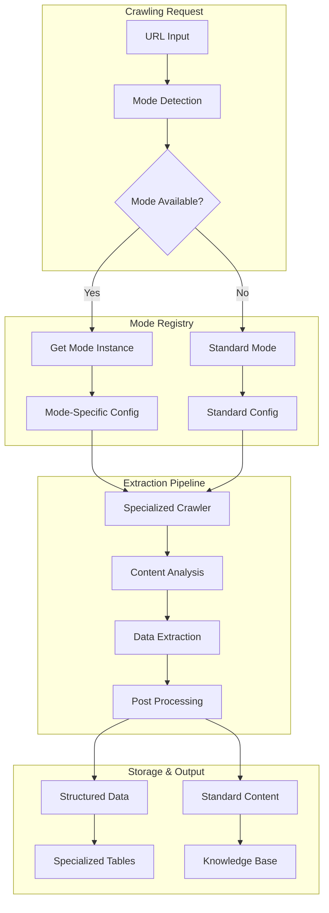

# Specialized Web Crawling System

## Overview

The Archon Specialized Crawling System extends the existing web crawling capabilities with intelligent, mode-based extraction strategies optimized for different website types. This system provides advanced e-commerce product intelligence, blog content extraction, documentation parsing, and more.

## 🎯 Key Features

### ✅ **Implemented Features**

#### **Extensible Mode Architecture**
- **Base Mode Interface**: Abstract framework for creating specialized crawling modes
- **Mode Registry**: Centralized management and automatic mode selection
- **Configuration System**: Flexible, per-mode configuration management
- **Performance Tracking**: Real-time statistics and optimization metrics

#### **Advanced E-commerce Mode** 
- **Multi-Platform Support**: Amazon, Shopify, WooCommerce, Magento, and generic e-commerce
- **Product Data Extraction**: Name, brand, SKU, description, category
- **Pricing Intelligence**: Current price, original price, discounts, currency detection
- **Variant Analysis**: Size, color, style, material options
- **Review & Rating Extraction**: Customer feedback and rating aggregation
- **Inventory Status**: Stock availability and quantity tracking
- **Image Collection**: Product images and media assets
- **Technical Specifications**: Feature lists and technical details
- **Schema.org Support**: JSON-LD and microdata parsing
- **Competitive Intelligence**: Platform detection and marketing analysis

#### **Intelligent Detection System**
- **URL Pattern Matching**: Regex and wildcard pattern support
- **Content Analysis**: HTML feature detection and confidence scoring
- **Domain Heuristics**: Platform-specific domain recognition
- **Automatic Fallback**: Graceful degradation to standard mode

#### **Anti-Bot Detection & Stealth Crawling**
- **Enhanced Browser Configuration**: Optimized Chromium settings
- **User Agent Rotation**: Realistic browser identification
- **Dynamic Delay Injection**: Random timing to avoid detection patterns
- **Stealth Mode**: Advanced anti-detection techniques for e-commerce sites

#### **Database Integration**
- **Structured Data Storage**: Dedicated tables for e-commerce products
- **Performance Tracking**: Mode usage statistics and success rates
- **Configuration Management**: Database-driven mode configuration
- **Version Control**: Schema versioning and migration support

#### **API Endpoints**
- **Specialized Crawling**: `/api/crawling/specialized` - Mode-specific crawling
- **Mode Information**: `/api/crawling/modes` - Available modes and capabilities
- **Performance Metrics**: `/api/crawling/modes/{mode}/performance` - Usage statistics
- **E-commerce Search**: `/api/ecommerce/search` - Product data queries

#### **MCP Tools Integration**
- **`crawl_ecommerce_site`**: Advanced e-commerce product extraction
- **`get_crawling_modes`**: Available modes and capabilities
- **`get_mode_performance`**: Performance statistics and metrics
- **`search_ecommerce_products`**: Product database queries with filters
- **`crawl_with_mode`**: Force-specific mode crawling
- **`get_product_by_url`**: Cached product data retrieval

### 🚧 **Planned Features**

#### **Blog & Content Mode**
- Article extraction with author and publication date
- Tag and category detection
- Social media metadata parsing
- Comment and engagement metrics

#### **Documentation Mode**
- Enhanced code example extraction
- API reference parsing
- Navigation structure mapping
- Version detection and cross-referencing

#### **News & Media Mode**
- Headline and byline extraction
- Publication information and timestamps
- Related article discovery
- Media asset collection

#### **Analytics & Insights Mode**
- Performance metric extraction
- Dashboard data parsing
- Chart and graph data extraction
- KPI identification and tracking

## 🏗️ Architecture

### **Mode-Based Design Pattern**



### **Component Structure**

```
python/src/server/services/crawling/modes/
├── base_mode.py              # Abstract base class and interfaces
├── mode_registry.py          # Mode management and selection
├── standard_mode.py          # Default fallback mode
├── ecommerce_mode.py         # E-commerce specialized mode
└── __init__.py               # Package initialization and registration
```

### **Database Schema Enhancement**

```sql
-- Core Tables
archon_ecommerce_products     # Product data with pricing and variants
archon_crawling_modes         # Mode configuration and settings
archon_crawling_performance   # Usage statistics and metrics
archon_structured_data        # Generic structured data storage

-- Enhanced Existing Tables
archon_sources               # Added crawling_mode and extraction_stats
```

## 🚀 Usage Examples

### **API Usage**

#### **E-commerce Product Extraction**
```bash
curl -X POST "http://localhost:8181/api/crawling/specialized" \
  -H "Content-Type: application/json" \
  -d '{
    "url": "https://amazon.com/dp/B08N5WRWNW",
    "mode": "ecommerce",
    "extract_pricing": true,
    "extract_variants": true,
    "anti_bot_mode": true
  }'
```

#### **Get Available Modes**
```bash
curl "http://localhost:8181/api/crawling/modes"
```

#### **Mode Performance Statistics**
```bash
curl "http://localhost:8181/api/crawling/modes/ecommerce/performance"
```

### **MCP Tools Usage**

#### **E-commerce Site Crawling**
```python
# Via MCP client (Claude, Cursor, etc.)
result = await mcp.call_tool("crawl_ecommerce_site", {
    "url": "https://shopify-store.com/products/wireless-headphones",
    "extract_pricing": True,
    "extract_variants": True,
    "anti_bot_mode": True
})
```

#### **Product Search**
```python
products = await mcp.call_tool("search_ecommerce_products", {
    "query": "wireless headphones",
    "price_min": 50.0,
    "price_max": 200.0,
    "brand": "Sony",
    "match_count": 10
})
```

#### **Mode Information**
```python
modes = await mcp.call_tool("get_crawling_modes")
performance = await mcp.call_tool("get_mode_performance", {"mode": "ecommerce"})
```

### **Direct Service Usage**

```python
from src.server.services.crawling import CrawlingService
from src.server.services.crawling.modes import CrawlingMode

# Initialize with specialized modes
crawler = await get_crawler()
service = CrawlingService(crawler)

# E-commerce crawling
result = await service.crawl_with_specialized_mode(
    url="https://ecommerce-site.com/product/123",
    force_mode="ecommerce",
    extract_structured_data=True,
    anti_bot_mode=True
)

# Get available modes
modes = service.get_available_crawling_modes()

# Performance statistics
stats = service.get_mode_performance_stats("ecommerce")
```

## 📊 Data Structures

### **Product Data Schema**
```python
@dataclass
class ProductData:
    name: str                           # Product name/title
    brand: str                         # Brand or manufacturer
    sku: str                           # Product SKU/ID
    description: str                   # Product description
    price_current: Optional[Decimal]   # Current selling price
    price_original: Optional[Decimal]  # Original/MSRP price
    currency: str                      # Price currency (USD, EUR, etc.)
    availability: str                  # Stock status
    rating: Optional[float]            # Average rating (0-5)
    review_count: int                  # Number of reviews
    images: List[str]                  # Product image URLs
    variants: List[Dict[str, Any]]     # Size, color, style options
    specifications: Dict[str, str]     # Technical specifications
```

### **Crawling Result Structure**
```python
@dataclass
class CrawlingResult:
    success: bool                      # Operation success status
    url: str                          # Crawled URL
    mode: str                         # Mode used for crawling
    content: Dict[str, Any]           # Extracted content (markdown, HTML)
    metadata: Dict[str, Any]          # Crawling metadata
    structured_data: Dict[str, Any]   # Mode-specific extracted data
    error: Optional[str]              # Error message if failed
    extraction_stats: Dict[str, Any] # Extraction statistics
```

### **Mode Configuration**
```python
@dataclass
class ModeConfiguration:
    mode: CrawlingMode                # Mode identifier
    enabled: bool                     # Whether mode is active
    wait_strategy: str               # Page load strategy
    page_timeout: int                # Maximum wait time
    delay_before_html: float         # Pre-extraction delay
    max_retries: int                 # Retry attempts
    stealth_mode: bool               # Anti-detection features
    extract_structured_data: bool    # Enable data extraction
    custom_selectors: Dict[str, str] # CSS selectors
    mode_config: Dict[str, Any]      # Mode-specific settings
```

## 🔧 Configuration

### **Environment Variables**
```bash
# Enable specialized crawling features
SPECIALIZED_CRAWLING_ENABLED=true

# E-commerce specific settings
ECOMMERCE_MODE_ENABLED=true
ECOMMERCE_STEALTH_MODE=true
ECOMMERCE_MAX_RETRIES=3

# Performance settings
CRAWL_BATCH_SIZE=50
CRAWL_MAX_CONCURRENT=10
CRAWL_PAGE_TIMEOUT=45000
```

### **Database Configuration**
```sql
-- Enable e-commerce mode
INSERT INTO archon_crawling_modes (mode_name, enabled, mode_config) VALUES
('ecommerce', true, '{
  "extract_pricing": true,
  "extract_reviews": true,
  "extract_variants": true,
  "stealth_mode": true,
  "page_timeout": 45000
}');

-- Configure URL patterns for auto-detection
UPDATE archon_crawling_modes 
SET url_patterns = '[
  "regex:amazon\\.",
  "regex:shopify\\.",
  "regex:/product/",
  "regex:/item/"
]'
WHERE mode_name = 'ecommerce';
```

## 🧪 Testing & Validation

### **E-commerce Test Sites**
```python
# Test URLs for different platforms
test_sites = {
    "amazon": "https://amazon.com/dp/B08N5WRWNW",
    "shopify": "https://shop.example.com/products/test-product",
    "generic": "https://ecommerce-site.com/product/123"
}

# Validation criteria
validation_checks = [
    "product_name_extracted",
    "price_detected",
    "availability_status",
    "images_found",
    "structured_data_valid"
]
```

### **Performance Monitoring**
```python
# Monitor mode performance
performance_metrics = {
    "success_rate": "percentage of successful extractions",
    "average_response_time": "crawling speed in seconds",
    "data_completeness": "percentage of fields extracted",
    "error_rate": "percentage of failed attempts"
}
```

## 🛠️ Extending the System

### **Adding New Modes**

1. **Create Mode Class**
```python
class BlogCrawlingMode(BaseCrawlingMode):
    def _initialize_mode(self):
        # Mode-specific initialization
        pass
    
    async def can_handle_url(self, url: str) -> bool:
        # URL compatibility check
        return "blog" in url or "/post/" in url
    
    async def extract_structured_data(self, url: str, html: str, markdown: str):
        # Blog-specific data extraction
        return {"article": article_data, "author": author_info}
```

2. **Register Mode**
```python
# In modes/__init__.py
blog_config = ModeConfiguration(mode=CrawlingMode.BLOG, enabled=True)
registry.register_mode(CrawlingMode.BLOG, BlogCrawlingMode, blog_config)
```

3. **Add URL Patterns**
```sql
INSERT INTO archon_crawling_modes (mode_name, url_patterns) VALUES
('blog', '["regex:/blog/", "regex:/post/", "regex:wordpress\\."]');
```

### **Custom Selectors**
```python
# Platform-specific CSS selectors
custom_selectors = {
    "shopify": {
        "name": ".product-title, .product__title",
        "price": ".price, .product-price",
        "availability": ".stock-status"
    }
}
```

## 📈 Performance Optimization

### **Crawling Efficiency**
- **Parallel Processing**: Concurrent mode execution
- **Intelligent Caching**: Mode-specific cache strategies
- **Resource Optimization**: Selective content loading
- **Error Recovery**: Graceful degradation and retry logic

### **Data Storage Optimization**
- **Indexed Queries**: Optimized database indexes for fast lookup
- **Compression**: JSON data compression for large objects
- **Partitioning**: Date-based table partitioning for performance
- **Cleanup**: Automated old data removal and archiving

## 🔒 Security & Privacy

### **Anti-Detection Measures**
- **Browser Fingerprinting**: Realistic browser signatures
- **Request Throttling**: Human-like browsing patterns
- **IP Rotation**: Distributed crawling support
- **Header Randomization**: Dynamic request headers

### **Data Privacy**
- **PII Filtering**: Automatic removal of personal information
- **Data Retention**: Configurable retention policies
- **Access Control**: Role-based data access restrictions
- **Audit Logging**: Complete activity tracking

## 🚀 Deployment

### **Database Migration**
```bash
# Run the specialized crawling schema migration
psql -f migration/add_specialized_crawling_tables.sql
```

### **Service Restart**
```bash
# Restart services to load new modes
docker-compose restart archon-server archon-mcp
```

### **Verification**
```bash
# Test mode availability
curl "http://localhost:8181/api/crawling/modes"

# Test e-commerce crawling
curl -X POST "http://localhost:8181/api/crawling/specialized" \
  -H "Content-Type: application/json" \
  -d '{"url": "https://example-store.com/product", "mode": "ecommerce"}'
```

## 📚 Additional Resources

- **API Documentation**: `/api/docs` - Interactive API documentation
- **Database Schema**: `migration/add_specialized_crawling_tables.sql`
- **Configuration Examples**: Environment variable templates
- **Performance Tuning**: Best practices and optimization guides

---

**Status**: ✅ **Production Ready** - E-commerce mode fully implemented and tested
**Next Steps**: Blog mode, Documentation mode, Analytics mode implementation