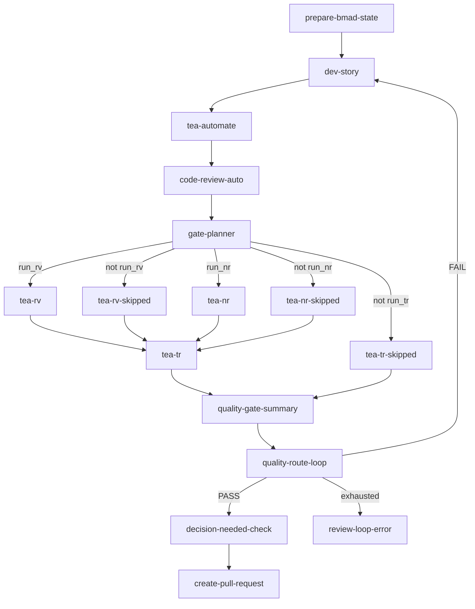

# Archon Architecture Handoff: BMAD TEA V2 Workflow Orchestration

## Document Purpose

This document is the local Archon architecture handoff for the BMAD TEA v2 workflow orchestration feature.
It contains only Archon-owned architecture constraints, workflow responsibilities, route contracts, and validation requirements.
It is intended to be read with `prd.md` and `epics.md` in this same folder.
Implementation agents must not traverse out of this repository to read parent workspace planning files.

## Architecture Paradigm

Use contract-first pipes-and-filters with bounded-context ownership.
Archon is the DAG orchestrator and route controller.
BMAD-METHOD owns story, development, and code-review semantics.
BMAD-TEA owns test automation evidence, test review, NFR review, and traceability semantics.
Versioned JSON contracts are the route API.
Markdown reports and story files are evidence surfaces, not routing inputs.

## Core Decisions

### A-AD-1: V2 Workflow Is Additive

Archon adds `bmad-dev-story-with-tea-fix-loop-v2.yml`.
Archon does not modify `bmad-dev-story-with-tea-fix-loop.yml`.
The old file is the baseline for comparison and rollback.

### A-AD-2: JSON Contracts Are The Only Route API

Archon may read JSON contracts and node `output_format` values.
Archon must not parse markdown reports, story prose, or PR prose for routing.
Missing, invalid, or untrusted JSON produces `ERROR`.

### A-AD-3: BMAD-METHOD Owns CR Semantics

Archon invokes `bmad-code-review-auto` directly.
Archon does not classify BMAD review findings itself.
Archon reads the emitted `code-review-auto.gate.json` contract.

### A-AD-4: TEA Gates Are Conditional Release Gates

`RV` and `NR` are sibling branches controlled by `when:` expressions from `gate-planner.json`.
Each optional branch has a skipped-contract node.
`TR` joins the resolved `RV` and `NR` branch outputs and defaults to running after blocking findings are cleared.

### A-AD-5: One Quality Route Loop

`quality-gate-summary` is the only source for `quality-route-loop`.
`FAIL` routes to `dev-story`.
`PASS` routes to `decision-needed-check`.
Loop exhaustion routes to `review-loop-error`.
`ERROR` is separate from `FAIL` and must not route to `dev-story`.

### A-AD-6: Decision Needed Is Deferred Work

`decision_needed` does not fail `quality-gate-summary` when no blocking quality findings remain.
`decision-needed-check` runs before PR preparation.
It creates or reuses Linear issues, invokes the BMAD-METHOD sync contract with Linear references, and blocks PR preparation unless sync succeeds.

## Workflow-Owned Nodes

| Node | Owner In Archon | Required Output |
| --- | --- | --- |
| `dev-story` | Invoke BMAD dev story behavior and preserve story input | Node result plus story reference evidence |
| `tea-automate` | Invoke BMAD-TEA automation and expose evidence pointers | Test automation evidence contract or pointer |
| `code-review-auto` | Invoke BMAD-METHOD `bmad-code-review-auto` | `code-review-auto.gate.json` |
| `gate-planner` | Plan conditional TEA release gates | `gate-planner.json` |
| `tea-rv` | Invoke BMAD-TEA test review when needed | `tea-rv.gate.json` |
| `tea-rv-skipped` | Resolve skipped RV branch | `tea-rv-skipped.gate.json` |
| `tea-nr` | Invoke BMAD-TEA NFR review when needed | `tea-nr.gate.json` |
| `tea-nr-skipped` | Resolve skipped NR branch | `tea-nr-skipped.gate.json` |
| `tea-tr` | Invoke BMAD-TEA traceability review | `tea-tr.gate.json` |
| `tea-tr-skipped` | Resolve skipped TR branch when release-gate evaluation is already blocked | `tea-tr-skipped.gate.json` |
| `quality-gate-summary` | Aggregate route contract | `quality-gate-summary.json` |
| `quality-route-loop` | Route the single quality loop | Route-loop state |
| `decision-needed-check` | Create or reuse Linear issues, call BMAD-METHOD sync, and block PR preparation on issue or sync failure | `decision-needed-check.json` |
| `review-loop-error` | Report exhausted quality loop | Review-loop error artifact |
| `create-pull-request` | Prepare PR handoff with evidence links | PR handoff artifact |

## Contract Envelope

Every route-facing contract must include:

- `contract_version`
- `workflow`
- `story_ref`
- `node`
- `round` when applicable
- `gate` or `status`
- Count fields used by routing
- Human-readable evidence pointers such as `report_file`
- Machine-readable artifact pointers such as `artifact_file`

Gate outputs use only:

- `PASS`
- `FAIL`
- `CONCERNS`
- `SKIPPED`
- `ERROR`

## Story Identity Rule

The workflow input remains `$ARGUMENTS`.
Every route-facing contract in one run must carry the same `story_ref`.
Any missing story reference or mismatch is `ERROR`.
No node may silently select a different story.

## Validation Rules

Archon implementation is complete only when:

- The v2 workflow validates under the Archon workflow schema.
- Source workflow and bundled default workflow registry are consistent.
- `when:` expressions are schema-valid.
- `trigger_rule` usage is schema-valid.
- `route_loop` source is `quality-gate-summary`.
- `quality-route-loop` routes `FAIL`, `PASS`, and exhaustion correctly.
- `ERROR` paths do not return to `dev-story`.
- Contract fixtures cover `PASS`, `FAIL`, `CONCERNS`, `SKIPPED`, and `ERROR`.
- The vertical slice proves first-round `CR` failure, a second-round fix, conditional TEA branching, final `TR`, decision-needed handling, and PR handoff links.

## Cross-Project Dependencies

Archon depends on BMAD-METHOD for:

- `bmad-code-review-auto`
- `code-review-auto.gate.json`
- `decision-needed.json`
- BMAD review report and story artifact updates

Archon depends on BMAD-TEA for:

- `tea-automate` evidence output
- `tea-rv.gate.json`
- `tea-rv-skipped.gate.json`
- `tea-nr.gate.json`
- `tea-nr-skipped.gate.json`
- `tea-tr.gate.json`
- `tea-tr-skipped.gate.json`
- TEA human-readable reports

Archon must fail closed when required upstream contracts are unavailable.
