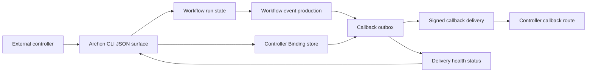

# Archon Architecture Handoff: Hermes Agent Workflow Commander

## Document Purpose

This document is the local Archon architecture handoff for Hermes Agent Workflow Commander.
It contains only the Archon-owned architecture constraints, package responsibilities, contracts, and validation rules needed for isolated implementation inside this repository.
It is intended to be read with `prd.md` and `epics.md` in this same folder.
Implementation agents must not traverse out of this repository to read parent workspace planning files.

## Architecture Paradigm

The Workflow Commander integration uses bounded contexts plus ports and adapters plus outbox delivery.
Archon remains the workflow execution and producer context.
Hermes remains the human-facing orchestration, callback consumer, reconciliation, and project-work context.
The Archon side therefore exposes generic producer contracts and does not embed Hermes product state.



## Core Decisions

### AD-A1: Controller Binding Is Generic

Archon stores reverse callback binding records for external controllers.
The binding identity uses project or codebase reference plus controller `provider` and controller `name`.
No Archon model, command, or schema should require Hermes-specific vocabulary.
Hermes may be one controller provider, but the Archon surface must remain reusable by future controllers.

### AD-A2: CLI JSON Is The Control Port

External controllers consume Archon state-changing workflow control through CLI JSON.
Every consumed command returns a schema-versioned result envelope.
The success envelope includes schema version, success flag, correlation id, relevant workflow run reference or binding reference, and a machine-readable payload.
The failure envelope includes schema version, success flag, correlation id when available, error code, diagnostic category, and machine-readable details.
Human-readable output may exist for users, but it must not be the state contract consumed by Hermes.

### AD-A3: Callback Outbox Is Non-Blocking

Workflow execution and callback delivery are separate concerns.
Archon writes eligible workflow events to a callback outbox after event production.
Delivery may retry, delay, duplicate safely, or fail terminally without rewriting workflow execution state solely because delivery failed.
Hermes reconciles state independently when callback delivery is missing or delayed.

### AD-A4: Callback Payloads Are Signed And Typed

Callback payloads are typed machine contracts.
Each payload includes schema version, event id, event type, occurred timestamp, Controller Binding reference, workflow run reference, project or codebase reference, signature metadata, and idempotency key.
Event id and idempotency key are stable across retry attempts.
The callback producer must support fixtures for workflow completed, workflow failed, approval requested, callback delivery failed, and workflow artifact events.

### AD-A5: Contract Examples Lead Implementation

Archon producer implementation must begin from local examples and schema tests.
Controller Binding payloads, workflow CLI envelopes, callback envelopes, and callback delivery status payloads are versioned contracts.
Producer code is complete only when local validation proves emitted payloads match those examples.
Stories that depend on missing examples remain blocked.

## Package Responsibilities

### `packages/cli`

`packages/cli` owns the command surface consumed by external controllers.
It should add or extend commands for Controller Binding lifecycle and workflow control JSON output.
Commands consumed by Hermes must support parseable JSON success and failure envelopes.
Commands should include cwd, correlation id, workflow run reference, binding reference when applicable, result payload, and machine-readable error details.

Candidate command families:

- Controller Binding create, update, rotate, disable, inspect, and diagnose.
- Workflow start and status.
- Workflow approve and reject.
- Workflow resume, retry, and cancel.
- Callback delivery health inspect or diagnose when exposed through CLI.

### `packages/core`

`packages/core` owns persisted records and database-backed store behavior.
It should persist Controller Binding records, callback outbox entries, delivery attempts, delivery status, retry state, terminal failure diagnostics, and binding status metadata.
It should keep workflow run state and callback delivery state separate.
It should provide transactional boundaries where event production and outbox enqueue must be durable together.

Candidate modules:

```text
packages/core/src/db/controller-bindings.ts
packages/core/src/db/callback-outbox.ts
packages/core/src/workflows/store-adapter.ts
```

### `packages/workflows`

`packages/workflows` owns workflow run contracts, event source contracts, and store interfaces used by the execution layer.
It should define event shapes or adapter contracts that allow eligible workflow events to be serialized into callback outbox records.
It should expose any workflow run references, approval pause references, artifact references, and terminal state fields required by the CLI envelope and callback envelope.
It must not import Hermes-specific consumer code.

Candidate modules:

```text
packages/workflows/src/store.ts
packages/workflows/src/event-emitter.ts
packages/workflows/src/schemas/
```

### `packages/server`

`packages/server` may expose diagnostic or callback-delivery helper routes if existing Archon server patterns make that appropriate.
It must not become the Hermes-to-Archon control path for state-changing Workflow Commander commands.
The required control path remains CLI JSON.

Candidate modules:

```text
packages/server/src/
```

## Data Contracts

### Controller Binding

Controller Binding records represent the reverse route from an Archon project or codebase to an external controller.

Required fields:

- Schema version.
- Project or codebase reference.
- Controller provider.
- Controller name.
- Callback route or target reference.
- Enabled state.
- Binding status.
- Rotation metadata when applicable.
- Created and updated timestamps.
- Diagnostic metadata safe for logs.

Status values must represent at least missing, valid, stale, disabled, rotated, and conflicting states.

### CLI Result Envelope

All state-changing CLI output consumed by external controllers uses one envelope family.

Required success fields:

- Schema version.
- Success flag.
- Correlation id.
- Command name or command family.
- Workflow run reference or binding reference when applicable.
- Machine-readable result payload.

Required failure fields:

- Schema version.
- Success flag.
- Correlation id when available.
- Error code.
- Diagnostic category.
- Machine-readable details.
- Recovery hint when available.

### Callback Event Envelope

Callback event envelopes are signed typed payloads delivered from Archon to the configured controller callback route.

Required fields:

- Schema version.
- Event id.
- Event type.
- Occurred timestamp.
- Controller Binding reference.
- Workflow run reference.
- Project or codebase reference.
- Signature metadata.
- Idempotency key.
- Machine-readable event payload.

Required event families:

- Workflow completed.
- Workflow failed.
- Approval requested.
- Callback delivery failed.
- Workflow artifact event.

### Callback Delivery Status

Callback delivery status is a persisted projection over outbox entries and delivery attempts.

Required fields:

- Outbox entry reference.
- Event id.
- Idempotency key.
- Workflow run reference.
- Controller Binding reference.
- Delivery state.
- Retry state.
- Attempt count.
- Last attempt timestamp when available.
- Next retry timestamp when available.
- Last error category when available.
- Terminal failure diagnostics when applicable.
- Reconciliation-needed marker when applicable.

Delivery state must be independent from workflow execution state.

## Contract Fixture Families

Local implementation readiness requires fixture coverage for these producer payloads:

- Archon CLI success envelope.
- Archon CLI error envelope.
- Controller Binding create, rotate, disable, and status payloads.
- Workflow start, status, approve, reject, resume, retry, and cancel results.
- Callback envelopes for workflow completed, workflow failed, approval requested, callback delivery failed, and workflow artifact events.
- Callback delivery health and terminal failure status payloads.
- Hermes rejection cases used to verify producer compatibility, including bad signature, stale timestamp, duplicate event id, wrong binding, unknown project, schema mismatch, and wrong-profile-secret.

Fixture examples may be regenerated locally from a shared source of truth, but implementation stories must not depend on reading parent workspace files at runtime.

## Source Layout Seed

```text
packages/cli/src/commands/
  controller-binding.ts
  workflow.ts

packages/core/src/db/
  controller-bindings.ts
  callback-outbox.ts

packages/core/src/workflows/
  store-adapter.ts

packages/workflows/src/
  store.ts
  event-emitter.ts
  schemas/

packages/server/src/
  callbacks/
```

The exact file names may change to match current Archon conventions.
The ownership boundaries should not change without updating this handoff and `epics.md`.

## Integration Sequence

### Phase A: Local Contract Readiness

Create or regenerate local fixture examples and schema tests for Controller Binding payloads, CLI envelopes, callback envelopes, and callback delivery status.
Producer stories that rely on a missing fixture family remain blocked.

### Phase B: Generic Controller Binding

Implement persistence, lifecycle commands, status inspection, rotation or disable behavior, and diagnostics for generic Controller Bindings.
The implementation must use `provider` and `name`, not Hermes-specific fields.

### Phase C: Workflow Control CLI JSON

Implement the shared CLI envelope family.
Apply it to workflow start, status, approve, reject, resume, retry, cancel, and diagnostics commands consumed by external controllers.
Malformed or unexpected states must produce machine-readable failure envelopes.

### Phase D: Callback Outbox And Signed Events

Serialize eligible workflow events into signed typed callback payloads.
Persist outbox entries and delivery attempts.
Retry delivery without changing workflow execution outcome solely because callback delivery failed.

### Phase E: Delivery Health

Expose callback delivery status and diagnostics through parseable status.
Hermes consumers must be able to show delayed, failed, duplicate, terminal, and reconciliation-needed states without treating callback delivery as the only source of truth.

## Cross-Project Boundaries

Archon produces Controller Binding, CLI, callback, and delivery-health contracts.
Hermes consumes those contracts through its CLI adapter, callback ingress, project-work materialization, gates, Story Timeline, and reconciliation.
Archon must not persist Hermes Project Work Items, Hermes HILT Gates, Hermes profile state, or Hermes reconciliation records.
Hermes must not mutate Archon workflow state through Archon HTTP APIs for this product.

Dependency records in `epics.md` must use this shape when either subproject blocks the other:

```text
Depends on: <subproject> Story <id or title>
Contract needed: <API/event/file/interface/schema>
Blocking behavior: <what must exist before this story can be completed>
Integration validation: <how both sides will be proven compatible>
```

## Validation

Run validation from inside this repository.

```text
bun run validate
```

Additional story-level validation should include targeted schema or fixture tests for the touched contract family.
Integration readiness requires the same example payloads to parse in Archon producer tests and Hermes consumer tests.
