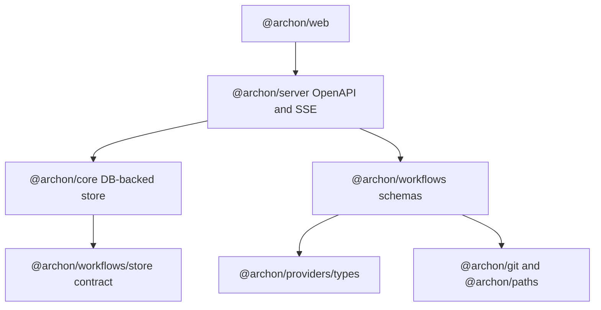
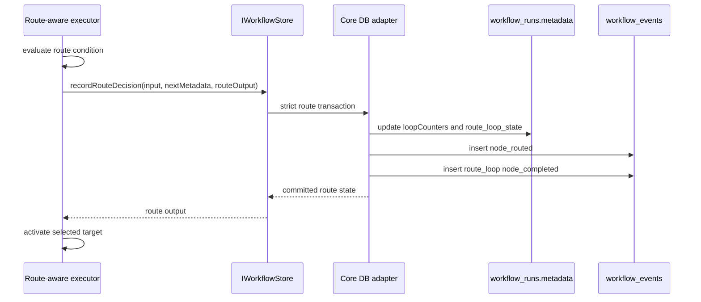
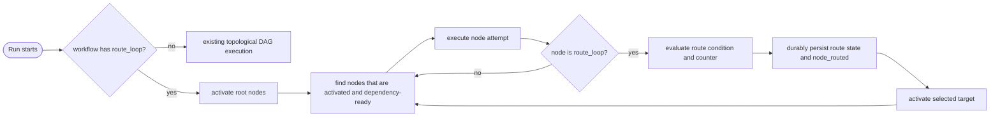

# Architecture Spine - Route Loop Routing

## Design Paradigm

Route Loop Routing uses an activation-gated DAG controller.

`depends_on` remains the readiness graph.
For workflows that contain `route_loop`, a route activation frontier decides which ready nodes may execute.
The route controller evaluates one source node, writes durable route state, writes required route audit evidence, then activates exactly one selected target.
Workflows without `route_loop` continue through the current static topological DAG executor behavior.

Layer ownership follows the existing package split.



## Invariants & Rules

### AD-1 - Route Loop Is A Controller Node [ADOPTED]

- **Binds:** D002, D003, D017, D027, route-loop-contract.
- **Prevents:** Treating `route_loop` as an AI loop, a prompt node, or a hidden nested subgraph.
- **Rule:** `route_loop` is a standalone DAG node mode in `dagNodeSchema`, mutually exclusive with `command`, `prompt`, `bash`, `script`, `approval`, `cancel`, and existing `loop`.

### AD-2 - Activation Gates Route Workflows [ADOPTED]

- **Binds:** D044, D045, D061, D062, runtime-contract Activation Model.
- **Prevents:** Unselected route branches running just because their dependencies are ready.
- **Rule:** A workflow containing any `route_loop` must execute through an activation frontier where root nodes start activated, route decisions activate selected targets, and dependency readiness is necessary but not sufficient for execution.

### AD-3 - Static DAG Behavior Remains The Default [ADOPTED]

- **Binds:** O005, PRD backward compatibility, existing DAG executor behavior.
- **Prevents:** Route Loop implementation changing workflows that do not declare `route_loop`.
- **Rule:** `executeDagWorkflow` must keep the current topological-layer path for workflows without route nodes, or route-aware scheduling must be gated so that non-route workflows preserve parse, execution, resume, retry, summary, and SSE behavior.

### AD-4 - Workflow Run Metadata Is The Route State Authority [ADOPTED]

- **Binds:** D012, D015, D051, D052, D057, PRD scheduler-state requirement.
- **Prevents:** Reconstructing authoritative route state from best-effort events or in-memory executor state.
- **Rule:** Route activation state, `loopCounters`, per-node attempt counters, latest invalidation set, and global execution sequence must be persisted in `workflow_run.metadata`; `workflow_events` are audit and projection records, not the scheduler source of truth.

### AD-5 - Route Decisions Are Strictly Durable Before Activation

- **Binds:** D036, D050, D105-D109, PRD required audit evidence.
- **Prevents:** Activating a node after a route decision whose audit event or route metadata was lost.
- **Rule:** Add a throwing store method for route decisions that updates run metadata and inserts required `node_routed` evidence in one durable operation before the executor activates the selected target.
  The `node_routed` event must include the route loop node id and source node id in addition to the selected outcome, target, condition, condition result, negative count, max iterations, attempt, and execution sequence.
  The existing non-throwing `createWorkflowEvent` contract must remain unchanged for ordinary observability events.

### AD-6 - Route Loop Completion Uses The Same Core Metadata As `node_routed`

- **Binds:** D031, D048, D109, runtime-contract Route Events And Output.
- **Prevents:** Divergence between what downstream nodes read from `$route_loop.output` and what the audit log reports.
- **Rule:** The strict route-decision store path must persist the route loop node's completed output with the same six-field core metadata as `node_routed`: `outcome`, `to`, `condition`, `condition_result`, `negative_count`, and `max_iterations`.
  Event-only fields such as route loop node id, source node id, attempt, and execution sequence stay on `node_routed` and do not expand the v1 `route_loop.output` object.

### AD-7 - Attempt And Rerun State Is Path Scoped [ADOPTED]

- **Binds:** D032-D034, D040, D067, D079-D085, D096.
- **Prevents:** Negative routes rerunning unrelated descendants or erasing historical attempts.
- **Rule:** When a negative route targets a completed node, create a new one-based attempt and invalidate only the selected dependency path from the negative target back to `route_loop.from` and the controller.
  Multiple paths back to `from` are allowed and all nodes on those paths rerun normally.

### AD-8 - Rerun Path Validity Is Checked Twice

- **Binds:** D073-D075, D083, D084, runtime-contract Rerun Path.
- **Prevents:** Resume, retry, or stale persisted state executing an unsafe graph shape that loader validation missed.
- **Rule:** Loader validation must reject invalid route graph shapes before execution, and runtime validation must recheck selected rerun path self-containment before applying route activation or invalidation.

### AD-9 - Route Conditions Reuse Grammar But Fail Hard [ADOPTED]

- **Binds:** D028-D030, D086-D095, route-loop-contract Conditions.
- **Prevents:** Route loops silently treating parser or output-reference errors as negative outcomes.
- **Rule:** `route_loop.condition` uses the existing condition expression grammar, but the route-loop evaluator must return a hard failure on parse errors and `OutputRefError`.
  Every referenced node in a route condition must equal `route_loop.from`.

### AD-10 - `not_activated` Is Projection State, Not Execution Output

- **Binds:** D061, D062, PRD observability.
- **Prevents:** Counting unselected branches as executed, skipped, failed, or completed.
- **Rule:** Internal execution results remain limited to executable node outcomes.
  REST and Web graph projections may expose `not_activated` for definition nodes that were never route-activated, while main run summaries and node counts exclude them from executed-node totals.

### AD-11 - Package Boundaries Stay Narrow

- **Binds:** Archon package split, project import rules.
- **Prevents:** Web importing server engine code or workflow engine importing core database modules.
- **Rule:** `@archon/workflows` owns schema, validation, route condition evaluation, route scheduling, and store interfaces.
  `@archon/core` owns DB-backed store implementation and route-decision transactions.
  `@archon/server` owns OpenAPI, REST projection, dashboard poller mapping, and SSE payloads.
  `@archon/web` owns production builder UX and generated API type consumption.

### AD-12 - Builder Save Surfaces Must Not Drop Route Loops

- **Binds:** D098-D104, PRD Web builder requirement, UX route-loop builder.
- **Prevents:** A user opening and saving a workflow that silently loses route ports or `route_loop` config.
- **Rule:** The production builder must support one input port and three named output ports for `route_loop`.
  Any secondary save or run surface must either full-round-trip `route_loop` or block editing/saving with an explicit unsupported-node error.

### AD-13 - Route Events Use A Dedicated SSE Payload

- **Binds:** D036, D105-D109, PRD live observability, UX execution visibility.
- **Prevents:** Server and Web independently inventing incompatible route-event payloads or hiding route decisions behind generic refetch-only events.
- **Rule:** In-process and persisted `node_routed` events must map to a `workflow_route` SSE payload carrying `runId`, `nodeId`, `fromNodeId`, `outcome`, `to`, `condition`, `conditionResult`, `negativeCount`, `maxIterations`, `attempt`, `executionSeq`, and `timestamp`.
  Clients may still refetch REST detail after receiving it, but the payload itself is the live route decision contract.

## Consistency Conventions

| Concern                   | Convention                                                                                                       |
| ------------------------- | ---------------------------------------------------------------------------------------------------------------- |
| YAML mode field           | Use `route_loop` only.                                                                                           |
| Event name                | Use `node_routed` for every selected route outcome.                                                              |
| SSE event type            | Use `workflow_route` for route decisions.                                                                        |
| Output and event metadata | Use snake_case fields.                                                                                           |
| Internal loop counter key | Preserve top-level `workflow_run.metadata.loopCounters` from Grill Me.                                           |
| New route state namespace | Use `workflow_run.metadata.route_loop_state` for activation, invalidation, attempts, and latest route snapshots. |
| Attempts                  | One-based per node, stored in metadata, and included in route-related events.                                    |
| Global execution order    | Increment `execution_seq` in metadata before writing attempt-bearing route events.                               |
| Unselected branches       | Treat as not activated, not skipped.                                                                             |
| Condition errors          | Fail the `route_loop` controller node and the workflow path, not the route budget.                               |
| Event durability          | Ordinary events stay best-effort; route decisions use a strict transactional path.                               |
| API types                 | Regenerate `packages/web/src/lib/api.generated.d.ts` after OpenAPI changes.                                      |

## Stack

| Name              | Version  |
| ----------------- | -------- |
| Archon            | 0.4.1    |
| Bun               | ^1.3.0   |
| TypeScript        | ^5.3.0   |
| Hono              | ^4.12.16 |
| @hono/zod-openapi | ^1.4.0   |
| Zod               | ^4.4.3   |
| React             | ^19.0.0  |
| Vite              | ^6.0.0   |
| @xyflow/react     | ^12.10.1 |
| @dagrejs/dagre    | ^2.0.4   |

## Structural Seed

### Runtime State Shape

```ts
interface RouteLoopRunMetadata {
  loopCounters?: Record<string, number>;
  route_loop_state?: {
    /** Nodes currently eligible for readiness checks in route-aware execution. */
    activated_node_ids: string[];
    /** Nodes whose previous latest output cannot satisfy readiness after a route rerun. */
    invalidated_node_ids: string[];
    node_attempts: Record<string, number>;
    execution_seq: number;
    latest_route_by_loop: Record<string, RouteLoopOutput>;
  };
}

interface RouteLoopOutput {
  outcome: 'positive' | 'negative' | 'exhausted';
  to: string;
  condition: string;
  condition_result: boolean;
  negative_count: number;
  max_iterations: number;
}
```

### Route Decision Transaction



### Source Layout

```text
packages/workflows/src/
  schemas/dag-node.ts          # route_loop schema and node type guard
  condition-evaluator.ts       # shared grammar plus strict route-loop evaluator entry point
  route-loop/
    state.ts                   # metadata parsing, normalization, and pure state transitions
    graph.ts                   # route target, cycle, and rerun path validation helpers
    scheduler.ts               # activation frontier and selected-path invalidation helpers
  dag-executor.ts              # route-aware execution loop integration
  store.ts                     # route-decision store contract

packages/core/src/
  db/workflows.ts              # strict route-decision transaction
  db/workflow-events.ts        # keep best-effort createWorkflowEvent, add strict insert helper if shared
  workflows/store-adapter.ts   # implements new store contract

packages/server/src/
  routes/schemas/workflow.schemas.ts  # node_routed and not_activated API contracts
  routes/api.ts                       # run detail projection
  adapters/web/workflow-bridge.ts     # SSE and dashboard poller mapping

packages/web/src/
  components/workflows/               # production builder and execution graph support
  experiments/console/builder/        # route_loop variant or explicit block on save/run
```

### Activation Flow



## Capability To Architecture Map

| Capability / Area                      | Lives in                                                                          | Governed by         |
| -------------------------------------- | --------------------------------------------------------------------------------- | ------------------- |
| `route_loop` YAML authoring            | `packages/workflows/src/schemas/dag-node.ts`, loader validation                   | AD-1, AD-8, AD-9    |
| Activation model                       | `packages/workflows/src/route-loop/scheduler.ts`, `dag-executor.ts`               | AD-2, AD-3, AD-4    |
| Counters, attempts, execution sequence | `packages/workflows/src/route-loop/state.ts`, `packages/core/src/db/workflows.ts` | AD-4, AD-7          |
| Durable route audit                    | `IWorkflowStore.recordRouteDecision`, core DB transaction                         | AD-5, AD-6          |
| Negative rerun path                    | `packages/workflows/src/route-loop/graph.ts`, `retry-state.ts` integration        | AD-7, AD-8          |
| Condition evaluation                   | `condition-evaluator.ts` strict route-loop entry point                            | AD-9                |
| Run detail and SSE                     | server workflow schemas, `api.ts`, `workflow-bridge.ts`                           | AD-10, AD-11, AD-13 |
| Production Web builder                 | `packages/web/src/components/workflows`                                           | AD-12               |
| Secondary builder                      | `packages/web/src/experiments/console/builder`                                    | AD-12               |

## Deferred

| Deferred                                           | Reason                                                                       |
| -------------------------------------------------- | ---------------------------------------------------------------------------- |
| General cyclic graph execution                     | Grill Me D001 chose controlled route loops only.                             |
| Node-level routes on every node                    | Grill Me D019 and D020 keep routes scoped to `route_loop`.                   |
| `$node.attempts` expression syntax                 | Grill Me D049 keeps attempt history audit-only in the first version.         |
| Dedicated route loop DB tables                     | Metadata and existing workflow events satisfy v1 without a schema migration. |
| Global emergency execution cap                     | Grill Me D023 rejected this in favor of required `max_iterations`.           |
| Route-loop-specific string normalization functions | Grill Me D088 and D095 keep existing comparison behavior.                    |
