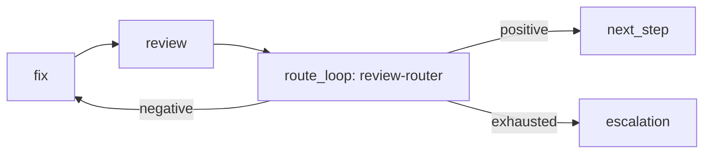
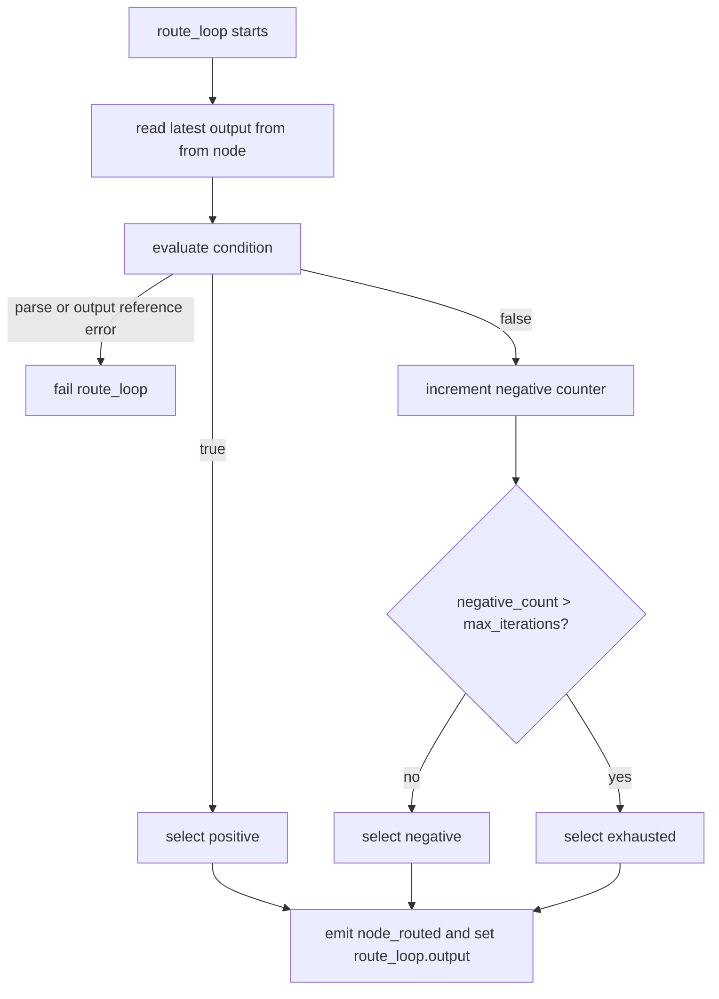
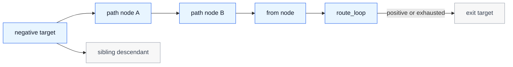

# Architecture Diagrams

Diagrams are companion content by spec law.
They are illustrative, but the behavior they show is normative where it matches `SPEC.md` and the other companions.

## Core Retry Loop

## Route Decision Algorithm

## Rerun Path Scope

The rerun set is the selected path from the negative target back to `route_loop.from` and then the route loop node.
Sibling descendants outside that selected path do not rerun merely because the negative target reran.
