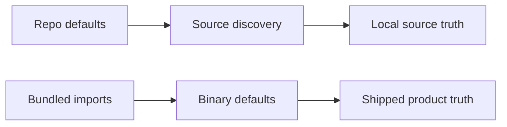

# Design Doc: Codex-First Workflow Surface Strategy

## 1. Purpose

Define what this fork should mean by "Codex-first" for local Archon usage without
degrading or muddying the original/cloud/Claude implementation surface.

This document is not an implementation PRD. It defines:
- the target Codex workflow surface for this fork
- which current workflows are strong enough to keep
- which current workflows should be removed or deferred
- what counts as real Codex parity versus misleading pseudo-parity
- the adaptation rules future Codex workflows must satisfy before they are
  shipped as defaults

This document is the design and policy anchor for follow-on implementation PRDs
and plans.

## 2. Problem Statement

This fork now has a meaningful Codex surface, but it is uneven.

Some Codex workflows are genuinely adapted and useful, especially
`archon-piv-loop-codex`. Others currently imply more maturity than they
actually have, especially the provisional `archon-feature-development-codex`
workflow. In addition, some behavior differs between repo-local source usage and
bundled/binary usage because bundled defaults are hardcoded in
`packages/workflows/src/defaults/bundled-defaults.ts`.

The risk is not only missing functionality. The larger risk is false
confidence:
- a workflow appears Codex-supported but is only a rename or provider patch
- a repo-local workflow exists but is not actually bundled or shipped
- a workflow appears parity-complete while relying on Claude-oriented
  assumptions
- documentation overstates what Codex can currently do inside Archon's workflow
  runtime

If this fork is going to be run mainly through Codex, the Codex defaults must
be intentionally curated, clearly documented, and held to a real quality bar.

## 3. Goals

### Primary Goals

- Make this fork clearly and honestly Codex-first for local usage.
- Preserve original/cloud/Claude behavior unless there is a correctness or
  shared-runtime parity reason to change it.
- Keep only genuinely Codex-adapted workflows in the default Codex surface.
- Remove or defer thin pseudo-parity workflows.
- Define a repeatable checklist for adapting future workflows to Codex.
- Separate repo-local experiments from truly shipped default assets.

### Secondary Goals

- Improve operator clarity for which workflow to use under Codex.
- Reduce bundle drift between source checkout behavior and bundled/binary
  behavior.
- Provide a basis for future Codex-specific implementation and workflow-builder
  work.

## 4. Non-Goals

- Rewriting the Claude/default workflow surface to match Codex.
- Forcing one-to-one migration of Claude-oriented workflow-node features where
  Codex support is absent or materially different.
- Claiming parity based on possible SDK analogues that Archon does not yet
  expose or validate.
- Implementing all Codex parity improvements in one slice.
- Replacing the current workflow-builder immediately.

## 5. Current Repo-Grounded State

### Strong Codex Surface

- `.archon/workflows/defaults/archon-assist-codex.yaml`
- `.archon/workflows/defaults/archon-piv-loop-codex.yaml`
- `.archon/commands/defaults/archon-assist-codex.md`
- `.agents/skills/archon/SKILL.md`
- `packages/core/src/clients/codex.ts`

### Weak Or Misleading Codex Surface

- the provisional `archon-feature-development-codex` workflow
- `.archon/workflows/defaults/archon-workflow-builder.yaml` when interpreted as
  Codex-safe
- bundled defaults in `packages/workflows/src/defaults/bundled-defaults.ts`,
  which currently lag repo-local Codex assets

### Current Runtime Constraint Surface

- Codex client behavior is implemented in `packages/core/src/clients/codex.ts`
- Claude client behavior is implemented in `packages/core/src/clients/claude.ts`
- workflow-level validation and provider-specific restrictions are enforced in
  `packages/workflows/src/validator.ts`
- workflow dependency support is described in
  `packages/workflows/src/deps.ts`
- default bundled asset behavior is defined in
  `packages/workflows/src/defaults/bundled-defaults.ts`
- current orchestrator routing remains assist-centric in
  `packages/core/src/orchestrator/prompt-builder.ts`

## 6. Design Principles

### 6.1 Honest Capability Boundaries

A workflow is not "Codex-supported" just because it has `provider: codex` or
because a rough SDK analogue may exist. It is Codex-supported only when the
actual Archon workflow surface, validation rules, runtime behavior, and
operator guidance all line up.

### 6.2 Codex Defaults Must Be Curated

Codex-specific defaults in this fork should be few, intentional, and high
quality. A thin or misleading workflow is worse than a missing one.

### 6.3 Preserve Shared Runtime Where Reasonable

Shared runtime code should stay shared unless:
- correctness requires a change
- parity requires a shared abstraction improvement
- a Codex-specific branch is unavoidable and contained

### 6.4 No Fake Parity

If a workflow cannot cleanly support Codex yet, it should remain:
- Claude-only
- repo-local experimental
- deferred for redesign

It should not be promoted into the default Codex surface prematurely.

### 6.5 Source And Bundle Must Not Disagree On Shipped Defaults

A workflow that is intended as a real default must exist consistently in:
- repo-local defaults
- bundled defaults
- discovery tests
- metadata surfaces where relevant

## 7. Decision Summary

| Surface | Decision | Status |
| --- | --- | --- |
| `archon-piv-loop-codex` | Keep as the reference-quality Codex workflow | Keep |
| `archon-assist-codex` | Keep as the general Codex assist lane | Keep |
| `archon-feature-development-codex` | Remove from the default surface for now; rebuild later only if it becomes a real Codex-native workflow | Remove / rebuild later |
| `archon-workflow-builder` | Leave shared/original workflow alone for now; do not treat it as Codex-safe | Defer |
| `archon-workflow-builder-codex` | Design as a separate future workflow, not a patch on the current builder | Future work |
| Codex capability crosswalk doc | Create as supporting reference documentation | Planned |
| Bundled-vs-repo default parity rules | Tighten and test | Planned |

## 8. Workflow-Specific Decisions

### 8.1 `archon-piv-loop-codex`

`.archon/workflows/defaults/archon-piv-loop-codex.yaml` is currently the
strongest Codex-native workflow in the repo.

Why it stays:
- it is meaningfully adapted for Codex behavior rather than just renamed
- it has explicit loop discipline and operator guidance
- it is already treated as part of the Codex surface
- it is useful as the quality benchmark for future Codex workflows

Design role:
- reference implementation
- quality bar for future Codex workflow adaptation
- baseline operator experience target

### 8.2 `archon-assist-codex`

`.archon/workflows/defaults/archon-assist-codex.yaml` remains the default Codex
assist workflow.

Why it stays:
- it serves a real routing purpose
- it already has a Codex-specific command surface via
  `.archon/commands/defaults/archon-assist-codex.md`
- it is useful as the general entry lane for Codex users

Constraint:
- it should not become the catch-all substitute for every Codex workflow need
- more specialized Codex workflows should not be forced through assist-centric
  routing forever

### 8.3 `archon-feature-development-codex`

The provisional `archon-feature-development-codex` workflow should be removed
from the default surface in its current form.

Why it should be removed:
- it is currently too thin to justify first-class default status
- it does not yet show the same level of Codex-specific adaptation as the PIV
  loop
- it creates the impression of feature-development parity without earning it
- it is currently repo-local only rather than a real shipped default

Future path:
- rebuild from scratch later if the fork needs a real Codex-native
  feature-development lane
- reintroduce only after prompt quality, operator guidance, runtime fit, and
  bundling/testing all meet the Codex default bar

### 8.4 `archon-workflow-builder`

`.archon/workflows/defaults/archon-workflow-builder.yaml` should remain
untouched for now and should not be presented as Codex-safe.

Why:
- it is shared/original behavior
- it currently carries Claude-oriented assumptions
- forcing mixed-provider pseudo-parity here would create confusion and risk

Future path:
- create a dedicated `archon-workflow-builder-codex` only when there is a clear
  Codex-safe design
- optimize it specifically for Codex-supported workflow authoring, validation,
  and operator use

## 9. Shipped Asset Policy

This fork needs a stricter distinction between four classes of workflow
surface:

| Class | Meaning | Allowed Visibility |
| --- | --- | --- |
| Shipped default | Supported, bundled, tested, operator-ready | CLI, UI, docs, bundle |
| Repo-local experimental | Present in repo for development or evaluation, not yet shipped | repo only |
| Deferred / Claude-only | Intentionally not for Codex yet | docs only |
| Misleading pseudo-parity | Looks supported but is not actually ready | not allowed |

A workflow must satisfy all of the following before it is considered a shipped
Codex default:
- genuinely Codex-adapted prompt and operator behavior
- valid against Codex workflow constraints
- bundled in shipped defaults if intended as a default
- covered by basic discovery and asset-parity tests
- described honestly in docs and metadata
- not dependent on unsupported Claude-only fields or assumptions

## 10. Codex Workflow Adaptation Checklist

Any future Codex-specific workflow must pass this checklist before being added
to the default surface.

### 10.1 Routing And Identity

- Is the provider explicit?
- Is the workflow name honest and specific?
- Does routing send the user to this workflow for the right class of task?
- Is the workflow distinguishable from assist-only routing?

### 10.2 Prompt And Operator Quality

- Is the prompt written for Codex behavior rather than copied from Claude?
- Are stop/continue semantics explicit?
- Are validation and iteration expectations scoped and concrete?
- Is the operator guidance at least parity quality with the Claude/default
  equivalent?

### 10.3 Runtime Fit

- Does it avoid unsupported or ignored Codex workflow fields?
- Does it avoid fake support for node capabilities that Archon does not expose
  on Codex?
- Are tool, sandbox, network, and reasoning assumptions aligned with actual
  Codex runtime behavior?

### 10.4 Shipped Asset Completeness

- Is the workflow present in repo defaults if intended?
- Is it present in bundled defaults if intended?
- Is any required command or supporting doc present and discoverable?
- Are repo-local-only docs clearly treated as repo-local support material, not
  shipped runtime assets?

### 10.5 Testing And Observability

- Is there at least one test or validation assertion proving it is
  discoverable?
- If bundled, is bundled inclusion tested?
- Are key routing assumptions covered?
- Does the runtime produce enough operator-visible evidence to debug failures?

### 10.6 Parity Honesty

- Is parity real, degraded, or intentionally absent?
- If degraded, is the limitation documented clearly?
- If a feature is unsupported, is the workflow redesigned instead of awkwardly
  translated?

## 11. Capability Crosswalk Policy

Future parity work must distinguish between:
- currently implemented Archon Codex support
- possible Codex SDK analogue
- unsupported in current Archon workflow/runtime surface
- intentionally left Claude-only

This fork should not claim parity based on theoretical analogue alone.

### Current Crosswalk Policy

- reasoning-effort style controls may map cleanly if already exposed through
  Codex runtime wiring
- sandbox and network controls may map cleanly if already exposed and validated
- system-prompt or instruction-lane parity must be proven in Archon's actual
  Codex integration before being claimed
- hooks, per-node controls, MCP shape, and similar workflow-node capabilities
  must be treated cautiously and documented as unsupported until verified

Supporting document planned:
- a focused reference doc comparing Claude-oriented runtime/workflow fields
  against Codex runtime/workflow equivalents or gaps

That reference should drive future implementation decisions, not speculative
assumptions.

## 12. Repo-Local vs Bundled Rules

The fork must clearly separate source-checkout convenience from bundled product
truth.

Rules:
- if a workflow is meant to be a true default, repo discovery and bundled
  imports must agree
- if a workflow is experimental, it must not be described as a real shipped
  default
- bundled asset tests must fail when intended defaults drift from the bundle
  set
- repo-local supporting docs may remain repo-only if they are not needed in
  bundled runtime behavior

Implication:
- repo-only README material such as
  `.archon/workflows/defaults/archon-piv-loop-codex.README.md` is acceptable
  when it is clearly operator support documentation rather than a bundled
  runtime dependency

## 13. Routing Target State

The desired routing model for this fork is:

- `archon-assist-codex` for general Codex assistance
- `archon-piv-loop-codex` for iterative Codex-native implementation and
  validation loops where that lane fits
- no `archon-feature-development-codex` until a real Codex-native
  implementation exists
- no claim that `archon-workflow-builder` is Codex-safe
- future specialized Codex workflows added only after passing the adaptation
  checklist

This keeps the visible Codex surface smaller, clearer, and more trustworthy.

## 14. Planned Follow-On Documents

This design doc should be followed by small, scoped implementation documents
rather than one large execution plan.

### 14.1 Supporting Reference Doc

Codex vs Claude workflow/runtime capability crosswalk:
- actual implemented Archon support
- likely analogues worth investigating
- unsupported fields
- redesign-required areas

### 14.2 Implementation PRD A

Codex workflow surface cleanup:
- align visible default surfaces and metadata to the actual Codex lane set
- tighten bundle/default parity expectations
- remove thin pseudo-parity from default routing

### 14.3 Implementation PRD B

Codex-native feature-development workflow v2:
- design from scratch
- define prompt structure, iteration contract, validation scope, and operator
  guidance
- benchmark against `archon-piv-loop-codex`

### 14.4 Implementation PRD C

Codex workflow-builder variant:
- separate workflow
- explicitly Codex-safe authoring and guidance contract
- no mixed-provider ambiguity

## 15. Recommended Implementation Sequence

1. Tighten shipped-vs-experimental asset rules and bundled parity checks.
2. Write the Codex-vs-Claude capability crosswalk reference.
3. Decide whether a Codex-native feature-development lane is actually needed.
4. If needed, design and implement it from scratch.
5. Only after that, design a Codex-safe workflow-builder variant.

This sequence prioritizes trustworthiness and clarity before expansion.

## 16. Risks

| Risk | Why it matters | Mitigation |
| --- | --- | --- |
| Over-claiming Codex parity | Creates operator confusion and brittle workflows | Keep unsupported areas explicit |
| Bundle drift | Source behavior differs from shipped behavior | Add asset parity rules and tests |
| Over-expanding Codex defaults too early | Increases maintenance and pseudo-parity risk | Keep the default set intentionally small |
| Shared-runtime churn | Could destabilize original/cloud behavior | Prefer contained, justified changes only |
| Rebuilding too soon without a capability crosswalk | Risks repeating thin adaptation | Write the crosswalk doc first |

## 17. Final Position

This fork should be Codex-first by being intentionally narrower and more
truthful, not by mirroring every Claude/default surface immediately.

Near-term Codex-first means:
- keep the strong Codex workflows
- remove the thin one
- defer the builder
- document the real capability boundary
- add new Codex workflows only when they are genuinely adapted and
  operator-ready

That is the path to a first-class Codex fork without degrading the
original/cloud implementation.
