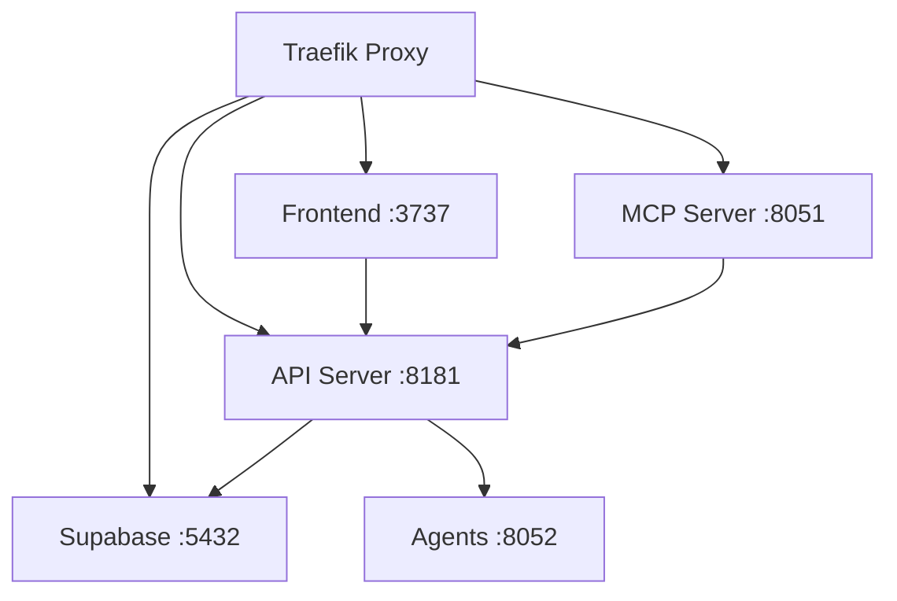

# Product Requirements Document (PRD)
## Archon Local-to-LAN Migration with Traefik Integration

**Version:** 1.0  
**Date:** September 2025  
**Author:** Mary, Business Analyst  
**Status:** Draft

---

## 1. Executive Summary

### 1.1 Objective
Migrate Archon's Docker-based deployment from local machine (localhost) to a dedicated server on the local network, leveraging existing Traefik proxy infrastructure with Let's Encrypt SSL certificates.

### 1.2 Problem Statement
Currently, Archon runs locally on individual machines, limiting access to the host machine only. Users need centralized access from multiple devices on the local network while maintaining the simplicity of the current Docker deployment.

### 1.3 Solution Overview
Deploy Archon containers to a dedicated server, integrate with existing Traefik reverse proxy on the 'proxy' network, and provide secure HTTPS access via *.mcdonaldhomelab.com domain.

---

## 2. Goals & Objectives

### 2.1 Primary Goals
- Enable multi-device access to Archon within local network
- Maintain zero-authentication requirement for LAN users
- Leverage existing Traefik/Let's Encrypt infrastructure
- Preserve all current functionality

### 2.2 Success Metrics
| Metric | Target | Measurement Method |
|--------|--------|-------------------|
| Service Availability | >99% uptime | Health check monitoring |
| Response Time | <200ms for API calls | Traefik metrics |
| Deployment Time | <30 minutes | Time from start to operational |
| User Access | Any LAN device can connect | Browser connectivity test |
| SSL Grade | A+ rating | SSL Labs test |

### 2.3 Non-Goals
- External internet access (LAN only)
- User authentication/authorization
- Multi-tenancy or user isolation
- Kubernetes migration
- Database migration (uses existing internal Supabase)

---

## 3. User Stories

### 3.1 End User Stories
```
AS A knowledge worker on the local network
I WANT TO access Archon from any device
SO THAT I can use the knowledge base from my laptop, desktop, or tablet
```

```
AS A developer using MCP tools
I WANT TO connect to the MCP server remotely
SO THAT I can integrate Archon with my IDE from any workstation
```

### 3.2 Administrator Stories
```
AS A system administrator
I WANT TO deploy Archon once on a server
SO THAT all users can access it without individual installations
```

---

## 4. Technical Requirements

### 4.1 Infrastructure Requirements

| Component | Requirement | Specification |
|-----------|------------|---------------|
| **Server OS** | Linux-based | Ubuntu 22.04 LTS or similar |
| **CPU** | Minimum cores | 2 vCPU |
| **Memory** | Minimum RAM | 4GB (8GB recommended) |
| **Storage** | Disk space | 20GB available |
| **Network** | Connectivity | Gigabit Ethernet |
| **Docker** | Version | 24.0+ with Compose v2 |
| **Traefik** | Existing setup | v3.x with Let's Encrypt |

### 4.2 Network Architecture

```yaml
External Networks:
  - proxy (existing Traefik network)

Internal Networks:  
  - archon-internal (bridge, isolated)

Service Connectivity:
  - Frontend → proxy + archon-internal
  - Backend → proxy + archon-internal
  - MCP → proxy + archon-internal
  - Agents → archon-internal only
  - Supabase → proxy (internal database server)
```

### 4.3 Domain & Routing Strategy

| Service | URL | Port | Traefik Route |
|---------|-----|------|---------------|
| Frontend | archon.mcdonaldhomelab.com | 3737 | Host rule |
| API | archon.mcdonaldhomelab.com/api | 8181 | Path prefix |
| MCP | archon.mcdonaldhomelab.com/mcp | 8051 | Path prefix |
| Agents | Internal only | 8052 | No external route |
| Supabase | supabase.mcdonaldhomelab.com | 5432/443 | Host rule (internal) |

### 4.4 Security Requirements

- **TLS/SSL:** Let's Encrypt certificates via Traefik
- **Network Isolation:** Dual network architecture (proxy + internal)
- **CORS:** Eliminated through single-origin proxy
- **Firewall:** Only ports 80/443 exposed
- **Docker Socket:** Remove if MCP container control not required

---

## 5. Functional Specifications

### 5.1 Modified Components

| Component | Changes Required |
|-----------|-----------------|
| **docker-compose.yml** | Add conditional Traefik labels using environment variables |
| **.env files** | Create .env.local and .env.lan templates for mode switching |
| **Frontend code** | Verify VITE_API_URL usage, remove hard-coded localhost references |
| **Backend code** | Update CORS configuration to use environment variables |
| **Service configs** | Check all inter-service communication uses environment variables |
| **Deployment script** | Create deploy.sh to manage environment switching |
| **Networks** | Conditional proxy network based on USE_PROXY_NETWORK variable |
| **Port bindings** | Conditional binding (127.0.0.1 for local, 0.0.0.0 for LAN) |

### 5.2 New Components

| Component | Purpose |
|-----------|---------|
| **.env.local** | Environment template for local deployment mode |
| **.env.lan** | Environment template for LAN deployment mode with Traefik |
| **deploy.sh** | Deployment mode switcher script |
| **unified-deployment-strategy.md** | Documentation for environment-based deployment |

### 5.3 Service Dependencies



---

## 6. Implementation Plan

### 6.1 Phase 1: Environment Preparation & Code Review (Day 1-2)
- [ ] Verify Traefik proxy network exists and operational
- [ ] Create DNS entries for archon.mcdonaldhomelab.com
- [ ] Install Docker/Compose on target server
- [ ] Clone Archon repository to server
- [ ] **Code Review: Search for hard-coded localhost/port references**
- [ ] **Code Review: Verify all services use environment variables**
- [ ] **Code Review: Check CORS configuration is dynamic**
- [ ] Create .env.local template (copy from .env.example)
- [ ] Create .env.lan template with LAN-specific values
- [ ] Test environment variable switching locally

### 6.2 Phase 2: Code Updates & Configuration (Day 3-4)
- [ ] **Update frontend code to use environment variables**
- [ ] **Update backend CORS to read from environment**
- [ ] **Fix any hard-coded service URLs found in review**
- [ ] Modify docker-compose.yml to support environment variables
- [ ] Add conditional Traefik labels (traefik.enable=${ENABLE_TRAEFIK})
- [ ] Configure conditional network attachment
- [ ] Create deploy.sh script for mode switching
- [ ] Test local mode with .env.local
- [ ] Add container resource limits

### 6.3 Phase 3: Deployment & Testing (Day 5-6)
- [ ] Test local mode: `DEPLOYMENT_MODE=local ./deploy.sh`
- [ ] Switch to LAN mode: `DEPLOYMENT_MODE=lan ./deploy.sh`
- [ ] Verify Traefik routing and SSL certificates
- [ ] Test instant rollback: `DEPLOYMENT_MODE=local ./deploy.sh`
- [ ] Validate all service endpoints
- [ ] Test from multiple client devices

### 6.4 Phase 4: Optimization & Documentation (Day 7)
- [ ] Performance testing and tuning
- [ ] Configure auto-restart policies
- [ ] Document access URLs
- [ ] Create troubleshooting guide
- [ ] Set up monitoring alerts

---

## 7. Acceptance Criteria

### 7.1 Functional Acceptance
- [ ] Web UI accessible at https://archon.mcdonaldhomelab.com
- [ ] API responds to health checks
- [ ] MCP server connectable from IDE
- [ ] Knowledge base search functional
- [ ] File upload/download working
- [ ] All existing features operational

### 7.2 Performance Acceptance
- [ ] Page load time <2 seconds
- [ ] API response time <200ms average
- [ ] Supports 5 concurrent users
- [ ] No memory leaks over 24 hours
- [ ] Auto-recovery from container failures

### 7.3 Security Acceptance
- [ ] SSL certificate valid and auto-renewing
- [ ] No exposed ports except 80/443
- [ ] Services unreachable from internet
- [ ] Internal network properly isolated
- [ ] No CORS errors in browser console

---

## 8. Risk Mitigation

### 8.1 Identified Risks & Mitigations

| Risk | Probability | Impact | Mitigation |
|------|------------|---------|------------|
| Traefik misconfiguration | Medium | High | Test with staging certs first |
| Network latency issues | Low | Medium | Implement caching layer |
| Container resource exhaustion | Medium | High | Set memory/CPU limits |
| DNS resolution failures | Low | High | Use IP as fallback |
| Data loss during migration | Low | Critical | Backup before migration |

### 8.2 Rollback Plan

**Recommended Approach: Environment Variable-Based Deployment**

Instead of maintaining separate configurations, use a single `DEPLOYMENT_MODE` environment variable to instantly switch between local and LAN deployments:

#### Quick Switch Method
```bash
# Deploy to LAN
DEPLOYMENT_MODE=lan ./deploy.sh

# Instant rollback to local
DEPLOYMENT_MODE=local ./deploy.sh
```

#### Benefits of This Approach
1. **Zero code changes** - Single docker-compose.yml for both modes
2. **Instant rollback** - Switch modes in <30 seconds
3. **No configuration drift** - Same codebase for both environments
4. **Testing flexibility** - Test LAN config locally first
5. **Progressive migration** - Can run hybrid mode temporarily

#### Implementation
- Use `.env.local` and `.env.lan` template files
- Switch between them with deployment script
- Traefik labels controlled by `ENABLE_TRAEFIK` variable
- Port bindings adapt based on `DEPLOYMENT_MODE`
- Network configuration changes via `USE_PROXY_NETWORK`

#### Fallback Options
1. **Instant revert**: `cp .env.local .env && docker-compose restart`
2. **Hybrid mode**: Run some services local, others on LAN
3. **Complete isolation**: Keep local instance as permanent backup

---

## 9. Testing Strategy

### 9.1 Test Scenarios

| Test Case | Expected Result | Priority |
|-----------|-----------------|----------|
| Access frontend from 3 devices | All load successfully | Critical |
| Upload 100MB file | Completes without timeout | High |
| Restart server | Services auto-recover | Critical |
| Disconnect/reconnect network | Graceful handling | Medium |
| Concurrent user operations | No conflicts | High |
| SSL certificate renewal | Auto-renews | Medium |

### 9.2 Performance Benchmarks
- Homepage load: <1 second
- Search query: <500ms
- File upload: 10MB/s minimum
- Concurrent users: 5 without degradation

---

## 10. Future Considerations

### 10.1 Potential Enhancements
- Redis caching layer for improved performance
- Prometheus/Grafana monitoring stack
- Automated backup strategy
- WebSocket optimization
- Container auto-scaling

### 10.2 Migration Path
- Phase 2: Add authentication if needed
- Phase 3: External access via VPN
- Phase 4: Kubernetes migration for scale

---

## 11. Appendices

### 11.1 Configuration Templates
- docker-compose.traefik.yml template
- Traefik label configuration
- Environment variable reference
- Network architecture diagram

### 11.2 Reference Documentation
- [Traefik Documentation](https://doc.traefik.io/traefik/)
- [Docker Compose Networking](https://docs.docker.com/compose/networking/)
- [Let's Encrypt Integration](https://doc.traefik.io/traefik/https/acme/)
- [Archon Documentation](./CLAUDE.md)

---

## 12. Approval & Sign-off

| Role | Name | Signature | Date |
|------|------|-----------|------|
| Product Owner | | | |
| Technical Lead | | | |
| System Admin | | | |

---

*Document Version: 1.0*  
*Last Updated: September 2025*  
*Project Code: ARCHON-LAN-001*