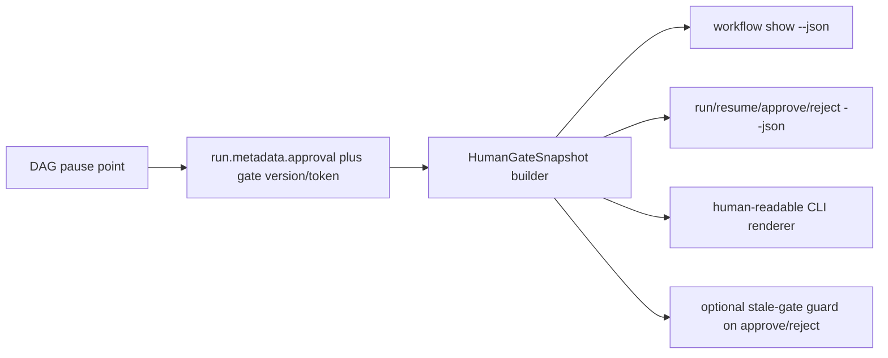

# ELI5 Summary (Read This First)

Right now Archon can pause correctly, but the outer tool using Archon does not
always get a clean, durable answer to the question:

> "What exactly is Archon waiting for the human to answer right now?"

The workflow engine already stores the paused question in the run metadata.
What is missing is a stable CLI/runtime contract that lets another host ask for
that paused question later, by run ID, in machine-readable form.

Simple version:

- today: Archon writes the human question into its own notebook, but the outer
  host mostly sees "workflow paused"
- target: Archon also exposes a durable receipt window so the outer host can
  always ask "show me the current human gate for run X"

That is what "durable runtime CLI enhancement" means here:

- `durable`: the question can be read back later, not only from live stdout
- `runtime`: the source of truth is the actual workflow run state, not chat
  memory or event logs
- `CLI enhancement`: the Archon CLI gets a proper read-back and JSON contract so
  Codex or any future host can surface the gate reliably

The planned fix is not "make Codex prettier." It is "make Archon expose the
paused human gate as a stable product surface."

# Problem Statement

## User-visible failure

A workflow can reach a final human review gate inside Archon, yet the outer
Codex UI conversation may not clearly surface that final gate. The human then
has to ask manually whether the run is paused and what it is waiting for.

## Verified current state

- `packages/workflows/src/dag-executor.ts` pauses approval and interactive-loop
  nodes by writing structured approval metadata into the workflow run.
- `packages/workflows/src/schemas/workflow-run.ts` defines `ApprovalContext`
  with fields such as `nodeId`, `message`, `lastOutput`, `type`, `iteration`,
  `captureResponse`, and reject-loop metadata.
- `packages/workflows/src/executor.ts` reduces a paused DAG result to
  `{ success: true, paused: true, workflowRunId }`.
- `packages/cli/src/commands/workflow.ts` prints prose such as
  `Workflow paused — waiting for approval.` but does not expose a stable paused
  payload for machine consumers.
- `packages/core/src/operations/workflow-operations.ts` provides active-run
  listing plus approve/reject mutations, but no durable "show me run X with its
  current human gate" contract.
- `packages/server/src/adapters/web/workflow-bridge.ts` already emits a
  pause-shaped SSE event for the web path, which proves the product concept, but
  that is a live event stream and not the durable read-back contract.
- `packages/server/src/routes/api.ts` already exposes raw run read-back through
  `GET /api/workflows/runs/:runId`, but that surface does not yet define a
  canonical `HumanGateSnapshot` or stale-gate semantics.

## Root cause

The canonical pause data exists, but it is trapped behind an incomplete
host-facing boundary:

- pause state is persisted
- live event fan-out exists
- durable CLI read-back is incomplete
- raw API read-back exists but does not yet freeze canonical human-gate
  semantics
- mutating commands return too little structured information

As a result, hosts that rely on Archon CLI control surfaces cannot reliably
recover and present the active human gate after the moment of pause.

# Solution Concept

Introduce a host-neutral `HumanGateSnapshot` contract derived from workflow run
state, and make it available through both:

1. a durable read-back command such as `archon workflow show <run-id> --json`
2. JSON envelopes on mutating commands that can pause or transition a run

The snapshot must be semantic first and presentation second:

- semantic fields are the canonical contract
- display hints are optional conveniences
- events and chat messages remain observability surfaces, not source of truth

The plan also adds stale-gate protection so a host can avoid approving or
rejecting the wrong pause instance if the same run pauses multiple times.



# In Scope

- define a stable `HumanGateSnapshot` contract
- persist enough pause-instance identity to distinguish one gate from the next
- add a durable per-run read-back CLI surface
- add JSON output for mutating commands that currently only emit prose
- keep human-readable CLI output, but make it driven by the same snapshot logic
- cover both approval gates and interactive-loop gates
- handle compatibility for already-paused older runs
- review API/server duplication risk and define the minimum parity required in
  the same slice
- add unit and end-to-end validation for clean JSON and stale-gate behavior

# Out Of Scope

- full Codex Desktop integration work
- redesigning web UI pause presentation
- generic `workflow wait` or `workflow follow` streaming surfaces
- changing core approve/reject business semantics beyond what is needed for the
  snapshot and stale-gate safety
- broad database redesign unless current metadata storage proves insufficient
- changing message persistence into a canonical workflow-state source

# Plan Status & Controls

- Status: draft
- Planning mode: plan only, no implementation in this slice
- E2E Gate: required
- Expected implementation complexity: medium-high
- Primary risk class: contract-shape drift across CLI, operations, and API
- Rollback principle: additive surfaces first; existing prose paths remain valid
  until implementation is proven

# Unresolved Items (Canonical)

None currently block planning. The plan intentionally carries design decisions
that must be confirmed during Phase 0 before implementation starts.

# Phase Summary

| Phase | Goal | Outcome |
| --- | --- | --- |
| P0 | Freeze the contract | Stable `HumanGateSnapshot` shape and compatibility rules |
| P1 | Add runtime snapshot foundation | Canonical pause-instance data and builder helpers |
| P2 | Add durable CLI read-back and JSON output | Hosts can recover current gate by run ID |
| P3 | Align parity and docs | API/CLI drift is explicitly handled and documented |
| P99 | Prove end-to-end durability | Paused gate can be read, acted on, and validated cleanly |

# Current Inputs

- User requirement: keep the current answer style and recommendations, but also
  show the original Archon questions in the CLI-facing Codex conversation.
- Current pain: final human gate can exist in Archon without being highlighted
  into the outer Codex UI conversation.
- Earlier review direction: fix this as a durable Archon runtime/CLI contract,
  not only as a Codex skill shim.
- Peer-review input already gathered before this plan:
  - mutating-command JSON alone is not enough
  - a durable read-back surface is required
  - gate data should stay semantic and host-neutral
  - multiple pauses per run require gate-instance identity

# References

- `packages/workflows/src/executor.ts`
- `packages/workflows/src/dag-executor.ts`
- `packages/workflows/src/schemas/workflow-run.ts`
- `packages/cli/src/commands/workflow.ts`
- `packages/core/src/operations/workflow-operations.ts`
- `packages/server/src/adapters/web/workflow-bridge.ts`
- `docs/design/codex-first-workflow-surface-strategy.md`

# Repo Browser Preflight

## Verified runtime anchors

- `packages/workflows/src/executor.ts` currently collapses a paused DAG result to
  `{ success: true, paused: true, workflowRunId }`.
- `packages/workflows/src/schemas/workflow-run.ts` already defines the persisted
  `ApprovalContext` shape the plan intends to extend rather than replace.
- `packages/workflows/src/dag-executor.ts` already pauses both interactive-loop
  gates and approval nodes by writing approval metadata into the workflow run.
- `packages/cli/src/commands/workflow.ts` currently emits prose-only paused
  output and auto-resumes on `approve` and `reject` when the current CLI path
  supports resume.
- `packages/server/src/routes/api.ts` already exposes raw run read-back at
  `GET /api/workflows/runs/:runId`.

## Verified test homes

- `packages/cli/src/commands/workflow.test.ts` is the correct existing home for
  future CLI `workflow show`, JSON, stale-token, partial-success, and legacy
  compatibility tests. It already contains adjacent coverage for status,
  approve, and reject command behavior.
- `packages/server/src/routes/api.workflow-runs.test.ts` is the correct existing
  home for raw run read-back plus approve/reject route coverage. It already
  tests:
  - `GET /api/workflows/runs/:runId`
  - `POST /api/workflows/runs/:runId/approve`
  - `POST /api/workflows/runs/:runId/reject`
- `packages/server/src/routes/api.workflows.test.ts` is not the correct home for
  run mutation-route coverage; it covers workflow-definition routes instead.

## Verified absences that implementation must add

- there is no current `workflow show <run-id>` CLI command
- there is no current `expected-gate-token` or equivalent stale-gate CLI/API
  parameter
- there is no current `HumanGateSnapshot` contract, `humanGate` JSON envelope,
  `STALE_HUMAN_GATE` error code, or structured `launch_failed` branch

## Preflight outcome

- the plan's architecture and scope remain repo-grounded
- one test-target correction is required: server approve/reject route tests
  belong in `packages/server/src/routes/api.workflow-runs.test.ts`
- the P99 `bun test ... -t` strings below are planned test names to add during
  implementation; preflight verified the host test files, not those exact names

# Doc Surface Map

- Canonical plan: `docs/plans/human-gate-runtime-cli-durability_plan.md`
- No root `docs/project-brief.md` exists in this repo at preflight time.
- Current canonical doc anchors for this slice are:
  - `docs/design/codex-first-workflow-surface-strategy.md`
  - `docs/prd/workflow-node-display-names.prd.md`
  - this plan
- Likely implementation surfaces:
  - `packages/workflows/src/schemas/workflow-run.ts`
  - `packages/workflows/src/schemas/workflow.ts`
  - `packages/workflows/src/executor.ts`
  - `packages/workflows/src/dag-executor.ts`
  - `packages/core/src/operations/workflow-operations.ts`
  - `packages/cli/src/commands/workflow.ts`
  - `packages/server/src/routes/api.ts`
  - `packages/server/src/adapters/web/workflow-bridge.ts`
- Likely tests:
  - workflow engine pause-state tests
  - CLI JSON surface tests
  - operations/API parity tests
  - pause -> show -> approve/reject -> resume end-to-end smoke

# Context References

## Current pause persistence

Archon already persists approval context in workflow run metadata at pause time.
This is the strongest reason to anchor the design in runtime state rather than
in outer-host conversation plumbing.

## Current host gap

The workflow executor and CLI collapse a paused run into a thin boolean/prose
result. That is the narrowest seam that fails to carry enough information back
to Codex.

## Existing event precedent

The web workflow bridge already emits a structured pause event with `message`
and optional `lastOutput`. That proves the shape is product-reasonable, but it
is not durable because it only exists on the live event stream.

# Contract Decisions To Freeze In Phase 0

## Decision A: Where the canonical human-gate snapshot comes from

Options considered:

1. Extend current `metadata.approval` and normalize through a builder helper
2. Add a separate `metadata.humanGate`
3. Add new DB columns or a dedicated table

Planned choice:

- Option 1 for v1

Reason:

- current persisted approval context is already the real pause anchor
- it minimizes schema churn
- it keeps rollout small and reversible
- a builder helper can hide compatibility differences between old and new runs

## Decision B: Durable read-back surface

Options considered:

1. Add `workflow show <run-id> --json`
2. Widen `workflow status --json`
3. Add `workflow wait/follow`

Planned choice:

- Option 1 for v1

Reason:

- `status` is an active-runs list, not a durable per-run read-back contract
- `show` is the most direct and understandable operator surface
- `wait/follow` is useful later but is not required to solve the durable gate
  problem

## Decision C: Stale-gate protection

Options considered:

1. Optional gate token/version on approve/reject
2. Mandatory token on all approval commands
3. No token

Planned choice:

- Option 1 for v1

Reason:

- protects hosts against acting on an outdated pause instance
- does not break existing operator flows immediately
- supports gradual adoption by Codex and future hosts

## Decision D: Canonical data versus display hints

Options considered:

1. Semantic snapshot with optional display helpers
2. Canonical rendered prompt string only

Planned choice:

- Option 1 for v1

Reason:

- display strings are host- and UX-specific
- semantic fields are easier to version, test, and reuse
- human-readable rendering can still be generated from the same snapshot

## Decision E: `approve` and `reject` JSON semantics under auto-resume

Options considered:

1. Keep current auto-resume behavior and return the post-resume outcome envelope
2. Disable auto-resume in JSON mode and return mutation-only state
3. Keep auto-resume but return mutation-only state

Planned choice:

- Option 1 for v1

Reason:

- matches current CLI operator behavior
- is the most useful host contract for Codex and other callers
- avoids a mode-specific semantic split where JSON changes workflow behavior

Required freeze details:

- `approve --json` and `reject --json` still record the human decision and then
  attempt resume when current CLI semantics would do so
- JSON output must report both:
  - the recorded decision
  - the post-resume outcome when resume succeeds
- stale-token or invalid-status failures are `ok: false`
- "decision recorded but resume launch failed" is not a silent success or a
  generic failure; it must be an explicit structured partial-success state so a
  host knows the human decision was persisted and `workflow resume <run-id>` is
  the recovery action

# Proposed Contract Shape

The exact field names are a Phase 0 freeze task, but the contract should look
roughly like this:

```ts
interface HumanGateSnapshot {
  runId: string;
  workflowName: string;
  status: 'paused';
  workingPath?: string | null;
  gate: {
    kind: 'approval' | 'interactive_loop';
    nodeId: string;
    version: number;
    token: string;
    message: string;
    iteration?: number;
    lastOutput?: string;
    inputMode: 'approval' | 'feedback';
    allowedActions: Array<'approve' | 'reject'>;
    captureResponse?: boolean;
    rejection?: {
      count: number;
      maxAttempts: number;
      hasOnReject: boolean;
    };
    display?: {
      promptMarkdown: string;
      approveCommandExample: string;
      rejectCommandExample: string;
    };
  };
}
```

Design rules:

- `message` is canonical
- `display.*` is optional helper text
- `token` identifies a specific pause instance
- `version` allows future contract evolution and stale-gate comparison
- older paused runs that lack token/version must still map to a defined fallback
  compatibility mode

# Proposed JSON Envelope

Mutating commands should return structured envelopes when `--json` is enabled.

Paused example:

```json
{
  "ok": true,
  "outcome": {
    "status": "paused",
    "runId": "dc28611639298c292559847a993e79fb",
    "workflowName": "archon-piv-loop-codex",
    "workingPath": "/path/to/worktree",
    "humanGate": {
      "gate": {
        "kind": "interactive_loop",
        "nodeId": "fix-feedback",
        "token": "gate_abc123",
        "message": "Test the implementation yourself and review the code changes."
      }
    }
  }
}
```

Terminal example:

```json
{
  "ok": true,
  "outcome": {
    "status": "completed",
    "runId": "dc28611639298c292559847a993e79fb",
    "workflowName": "archon-piv-loop-codex"
  }
}
```

Approve example with current auto-resume semantics:

```json
{
  "ok": true,
  "decision": {
    "action": "approve",
    "recorded": true,
    "runId": "dc28611639298c292559847a993e79fb",
    "gateToken": "gate_abc123"
  },
  "resume": {
    "attempted": true,
    "status": "paused_again"
  },
  "outcome": {
    "status": "paused",
    "runId": "dc28611639298c292559847a993e79fb",
    "humanGate": {
      "gate": {
        "kind": "interactive_loop",
        "nodeId": "fix-feedback",
        "token": "gate_def456",
        "message": "Provide specific feedback on what needs fixing, or say approved to finalize."
      }
    }
  }
}
```

Approve example when decision is recorded but resume launch fails:

```json
{
  "ok": true,
  "decision": {
    "action": "approve",
    "recorded": true,
    "runId": "dc28611639298c292559847a993e79fb",
    "gateToken": "gate_abc123"
  },
  "resume": {
    "attempted": true,
    "status": "launch_failed",
    "recoveryCommand": "bun run cli workflow resume dc28611639298c292559847a993e79fb"
  },
  "outcome": null
}
```

Reject example with `on_reject` auto-resume:

```json
{
  "ok": true,
  "decision": {
    "action": "reject",
    "recorded": true,
    "runId": "dc28611639298c292559847a993e79fb",
    "gateToken": "gate_abc123",
    "reason": "Needs one more fix pass"
  },
  "resume": {
    "attempted": true,
    "status": "completed"
  },
  "outcome": {
    "status": "completed",
    "runId": "dc28611639298c292559847a993e79fb",
    "workflowName": "archon-piv-loop-codex"
  }
}
```

Error example:

```json
{
  "ok": false,
  "error": {
    "code": "STALE_HUMAN_GATE",
    "message": "The run is no longer waiting on the supplied gate token."
  }
}
```

# Phased Execution Plan

## Phase 0 — Contract Freeze

### P0-T1 Define `HumanGateSnapshot`

- Goal: freeze the semantic contract and field meanings before any code changes
- Files to touch later:
  - `packages/workflows/src/schemas/workflow-run.ts`
  - `packages/workflows/src/schemas/workflow.ts`
  - CLI/API output types as needed
- Commands to Run:
  - `rg -n "ApprovalContext|paused|workflow show|approval_pending" packages`
  - `bun run type-check`
- Exit Criteria:
  - contract fields are named and justified
  - approval and interactive-loop cases are both represented
  - semantic versus display fields are explicitly separated

### P0-T2 Freeze compatibility rules

- Goal: define how older paused runs without gate token/version behave
- Key decisions:
  - fallback snapshot behavior for legacy runs
  - whether token enforcement is optional or required per command version
  - error code shape for stale/missing token mismatches
- Exit Criteria:
  - implementation can proceed without inventing compatibility behavior mid-flight

### P0-T3 Freeze CLI surface map

- Goal: decide exact command additions and flags
- Candidate surfaces:
  - `workflow show <run-id>`
  - `workflow run --json`
  - `workflow resume --json`
  - `workflow approve --json [--expected-gate-token ...]`
  - `workflow reject --json [--expected-gate-token ...]`
- Exit Criteria:
  - no ambiguity remains about whether `status` or `show` is the canonical
    read-back path

### P0-T4 Freeze approve/reject JSON semantics

- Goal: lock exact JSON behavior against the current CLI auto-resume path
- Key decisions:
  - JSON mode does not disable auto-resume
  - approve/reject JSON returns decision status plus post-resume outcome when
    available
  - reject without `on_reject` returns a terminal cancelled outcome with
    `resume.attempted: false`
  - partial-success shape is defined for "decision recorded, resume launch
    failed"
  - stale-token mismatch is a validation failure, not a partial-success state
- Files to touch later:
  - `packages/cli/src/commands/workflow.ts`
  - `packages/core/src/operations/workflow-operations.ts`
  - any shared output schema/types
- Exit Criteria:
  - at least one approve example and one reject example are frozen in the plan
  - no ambiguity remains for hosts parsing approve/reject JSON

## Phase 1 — Runtime Snapshot Foundation

### P1-T1 Add pause-instance identity

- Goal: write gate version/token at each pause point
- Primary files:
  - `packages/workflows/src/dag-executor.ts`
  - `packages/workflows/src/schemas/workflow-run.ts`
- Notes:
  - approval node and interactive-loop node must both populate it
  - version/token generation must be deterministic enough for tests but unique
    enough per pause instance
- Exit Criteria:
  - every new paused run carries enough identity to distinguish repeated pauses

### P1-T2 Add snapshot builder helper

- Goal: centralize conversion from `WorkflowRun` plus metadata into a
  `HumanGateSnapshot`
- Primary files:
  - shared workflow or operations helper module to be chosen in implementation
- Notes:
  - builder must gracefully handle legacy runs
  - builder must be the only place that interprets approval metadata into the
    host-facing contract
- Exit Criteria:
  - CLI, operations, and API can all consume the same builder

### P1-T3 Enrich paused execution result

- Goal: stop collapsing paused DAG results to a boolean-only result
- Primary files:
  - `packages/workflows/src/executor.ts`
  - `packages/workflows/src/schemas/workflow.ts`
- Notes:
  - the execution result should either include the built snapshot or expose
    enough information for higher layers to do so without a second lookup
- Exit Criteria:
  - paused execution path carries structured pause data

### P1-T4 Add foundation tests

- Goal: lock behavior before CLI work starts
- Test focus:
  - approval pause snapshot
  - interactive-loop snapshot
  - legacy paused run fallback mapping
  - token/version presence on new runs
- Exit Criteria:
  - snapshot foundation is covered before surface expansion

## Phase 2 — CLI JSON And Durable Read-Back

### P2-T1 Add `workflow show <run-id>`

- Goal: allow any host or operator to read a run and its current human gate by
  ID at any time
- Primary files:
  - `packages/core/src/operations/workflow-operations.ts`
  - `packages/cli/src/commands/workflow.ts`
- Notes:
  - `show` should work for paused and terminal runs
  - `show --json` is the durable machine contract
  - human output should remain readable and concise
- Exit Criteria:
  - a paused run can be queried later without relying on the original stdout

### P2-T2 Add `--json` to mutating commands

- Goal: make `run`, `resume`, `approve`, and `reject` usable as clean machine
  surfaces
- Notes:
  - stdout must contain only JSON when `--json` is set
  - workflow event chatter must not pollute stdout in JSON mode
  - stderr can still carry human diagnostics when appropriate
- Exit Criteria:
  - command output is parse-safe for host integrations

### P2-T3 Add stale-gate guard

- Goal: let hosts pass an expected gate token and fail safely if the run is no
  longer at that gate
- Primary files:
  - operations layer plus CLI flag plumbing
- Notes:
  - token should remain optional in v1 for backward compatibility
  - error messages must be specific enough for operators and hosts
- Exit Criteria:
  - approving the wrong pause instance fails clearly instead of silently

### P2-T4 Add CLI tests

- Goal: prove the surface is durable and parse-safe
- Test focus:
  - `workflow show --json`
  - `workflow run --json` paused outcome
  - `workflow approve/reject --json` output shape
  - `workflow approve --json` partial-success envelope when decision recording
    succeeds but resume launch fails
  - stale-gate mismatch behavior
  - legacy paused-run fallback mapping without token/version
  - no stdout contamination in JSON mode
- Exit Criteria:
  - CLI host contract is test-backed

## Phase 3 — API Parity Review And Documentation

### P3-T1 Review approve/reject duplication

- Goal: prevent CLI/API drift on gate semantics
- Current risk:
  - server API approve/reject logic duplicates workflow operations behavior
- Planned minimum:
  - stale-gate validation on approve/reject must be shared or behaviorally
    identical across CLI and server routes
- Existing baseline to preserve:
  - raw run read-back already exists at `GET /api/workflows/runs/:runId`
  - parity work is about normalized `HumanGateSnapshot` and stale-gate
    semantics, not inventing first-time API visibility
- Frozen v1 API boundary:
  - CLI gets the canonical normalized `HumanGateSnapshot` contract in v1
  - `GET /api/workflows/runs/:runId` remains a raw run-plus-events surface in
    v1, with only additive metadata compatibility
  - server approve/reject routes must honor the same expected-gate-token
    validation semantics as CLI paths
- Exit Criteria:
  - there is one clear answer for where stale-gate validation lives

### P3-T2 Update operator documentation

- Goal: document the new durable surface for human-in-the-loop hosts
- Candidate docs:
  - CLI command reference
  - Archon Codex host skill references if operator protocol changes
- Exit Criteria:
  - future operators do not have to rediscover the durable gate pattern

### P3-T3 Assess web/server compatibility

- Goal: ensure live event surfaces still behave as expected after the runtime
  contract changes
- Notes:
  - web SSE event shape may not need expansion in v1
  - if API types change, regenerate or update derived web types accordingly
- Exit Criteria:
  - no silent regression on existing web approval path

## Phase 99 — End-to-End Gate

### P99-T1 CLI durability smoke

Prerequisite Contract:

```json
{
  "workflow_fixture_available": true,
  "pause_capable_fixture": true,
  "json_mode_supported": true
}
```

Commands to Run:

- Deterministic fixture/harness:
  - reuse the pause-capable gate shapes already present in
    `.archon/workflows/defaults/archon-interactive-prd.yaml`
  - prove them through targeted CLI integration coverage in
    `packages/cli/src/commands/workflow.test.ts`
- Exact verify commands to add during implementation and freeze:
  - `bun test packages/cli/src/commands/workflow.test.ts -t "workflow show --json returns active humanGate snapshot for paused run"`
  - `bun test packages/cli/src/commands/workflow.test.ts -t "workflow approve --json returns post-resume paused outcome with humanGate"`
  - `bun test packages/cli/src/commands/workflow.test.ts -t "workflow reject --json returns post-resume outcome or cancellation envelope"`
  - `bun test packages/cli/src/commands/workflow.test.ts -t "workflow approve --json rejects stale expected gate token"`
  - `bun test packages/cli/src/commands/workflow.test.ts -t "workflow approve --json returns decision-recorded launch-failed envelope when resume launch fails"`
  - `bun test packages/cli/src/commands/workflow.test.ts -t "workflow show --json maps legacy paused run without gate token into compatibility snapshot"`

Exit Criteria:

- paused gate is recoverable by run ID after the original pause moment
- returned gate message matches the workflow reality
- stale token mismatch is reproducible and explicit
- the structured partial-success envelope is proven when auto-resume launch
  fails after the decision is recorded
- legacy paused runs without token/version still map to the defined
  compatibility snapshot

E2E Mode: automated

Evidence:

- targeted CLI test evidence and captured JSON fixtures for:
  - paused run read-back
  - approve -> paused-again outcome
  - reject -> resumed or cancelled outcome
  - stale-token rejection
  - decision-recorded -> resume-launch-failed partial-success outcome
  - legacy paused-run compatibility mapping

Verify Commands:

- `bun test packages/cli/src/commands/workflow.test.ts -t "workflow show --json returns active humanGate snapshot for paused run"`
- `bun test packages/cli/src/commands/workflow.test.ts -t "workflow approve --json returns post-resume paused outcome with humanGate"`
- `bun test packages/cli/src/commands/workflow.test.ts -t "workflow reject --json returns post-resume outcome or cancellation envelope"`
- `bun test packages/cli/src/commands/workflow.test.ts -t "workflow approve --json rejects stale expected gate token"`
- `bun test packages/cli/src/commands/workflow.test.ts -t "workflow approve --json returns decision-recorded launch-failed envelope when resume launch fails"`
- `bun test packages/cli/src/commands/workflow.test.ts -t "workflow show --json maps legacy paused run without gate token into compatibility snapshot"`

### P99-T2 Web/API no-regression smoke

Prerequisite Contract:

```json
{
  "web_or_api_smoke_available": true,
  "approval_route_covered": true
}
```

Commands to Run:

- Exact verify commands to add during implementation and freeze:
  - `bun test packages/server/src/routes/api.workflow-runs.test.ts -t "GET /api/workflows/runs/:runId preserves raw paused run read-back"`
  - `bun test packages/server/src/routes/api.workflow-runs.test.ts -t "GET /api/workflows/runs/:runId remains raw-only in v1 while additive gate metadata is preserved"`
  - `bun test packages/server/src/routes/api.workflow-runs.test.ts -t "approve route rejects stale expected gate token"`
  - `bun test packages/server/src/routes/api.workflow-runs.test.ts -t "reject route preserves compatibility when no expected gate token is supplied"`

Exit Criteria:

- web/API path still works, or compatibility behavior is explicit and tested
- the v1 API boundary is proven: raw run read-back stays raw-only, while
  approve/reject routes match CLI stale-gate semantics

E2E Mode: automated

Evidence:

- API route test evidence covering:
  - existing raw run retrieval
  - explicit proof that normalized `HumanGateSnapshot` stays a CLI contract in
    v1 rather than silently reshaping the raw run route
  - stale-token validation on mutation routes
  - no-regression compatibility for callers that omit token checks

Verify Commands:

- `bun test packages/server/src/routes/api.workflow-runs.test.ts -t "GET /api/workflows/runs/:runId preserves raw paused run read-back"`
- `bun test packages/server/src/routes/api.workflow-runs.test.ts -t "GET /api/workflows/runs/:runId remains raw-only in v1 while additive gate metadata is preserved"`
- `bun test packages/server/src/routes/api.workflow-runs.test.ts -t "approve route rejects stale expected gate token"`
- `bun test packages/server/src/routes/api.workflow-runs.test.ts -t "reject route preserves compatibility when no expected gate token is supplied"`

# Acceptance Criteria

- A host can recover the active human gate from a run ID without reading chat
  messages or event logs.
- Approval and interactive-loop pauses share one canonical host contract.
- Mutating commands and read-back commands expose the same gate semantics.
- JSON mode is clean and parse-safe.
- Stale-gate protection exists and fails clearly when used.
- The "decision recorded, resume launch failed" branch is explicitly verified
  and recoverable.
- Legacy paused runs have explicit compatibility behavior.
- Existing human-readable CLI output remains usable.
- API/server duplication risk is handled explicitly rather than ignored.

# Risks And Gotchas

## Risk 1: Freezing the wrong contract too early

Impact:

- medium-high

Mitigation:

- make Phase 0 a real freeze step, not a hand-wave
- require peer review on the contract before implementation

## Risk 2: CLI and API drift

Impact:

- high

Mitigation:

- central snapshot builder
- one clear location for stale-gate validation
- parity tests if logic remains duplicated

## Risk 3: Clean JSON mode gets polluted by event rendering

Impact:

- high for host integrations

Mitigation:

- force quiet/event suppression in JSON mode
- add stdout-only assertions in tests

## Risk 4: Legacy paused runs lack token/version

Impact:

- medium

Mitigation:

- define fallback behavior before coding
- keep token checks optional in v1

## Risk 5: Over-scoping into generic streaming features

Impact:

- medium

Mitigation:

- keep `workflow show` as the durable v1 surface
- explicitly defer wait/follow and broader host orchestration

# Rollout Strategy

Planned rollout order:

1. additive runtime metadata and builder helper
2. durable read-back command
3. mutating-command JSON mode
4. stale-gate guard
5. parity and documentation cleanup

Rollback stance:

- if JSON or token semantics regress current operator flows, keep the old prose
  path intact while disabling only the new surface

# Complexity Assessment

This is not a tiny CLI tweak.

Assessment:

- implementation complexity: medium-high
- testing complexity: medium-high
- migration risk: moderate

Reason:

- the data already exists, which keeps the slice bounded
- but the contract crosses workflow runtime, CLI, operations, and possibly API
- stale-gate protection adds correctness value but also versioning and
  compatibility work

# Peer Review Loop Log

## Cycle 0

- Status: prepared for peer review
- Notes:
  - initial plan authored from current code state
  - awaiting external review before any freeze or implementation decision

## Cycle 1

- Status: revised after review
- Review verdict: `Needs-revision`
- Findings carried into revision:
  - P99 verify commands were placeholders and needed exact frozen commands
  - approve/reject JSON semantics were ambiguous under current CLI auto-resume
  - API gap wording overstated the absence of durable read-back
- Revisions applied:
  - froze exact P99 CLI and API verify commands
  - added an explicit Phase 0 decision for approve/reject JSON semantics
  - added concrete approve JSON examples, including partial-success resume
    failure handling
  - tightened API wording to distinguish existing raw run read-back from the
    missing canonical `HumanGateSnapshot` contract
- Next step:
  - rerun peer review on the revised plan

## Cycle 2

- Status: revised after review
- Review verdict: `Needs-revision`
- Findings carried into revision:
  - the partial-success resume-launch-failed branch was specified but not
    explicitly verified
  - legacy paused-run compatibility lacked a frozen end-gate verify hook
  - the v1 API parity boundary needed a more explicit freeze line
- Revisions applied:
  - added CLI verify commands and exit criteria for the partial-success branch
  - added CLI verify commands and evidence expectations for legacy paused-run
    compatibility
  - froze the v1 API boundary as raw run-plus-events read-back with additive
    metadata only, while keeping stale-gate parity on approve/reject routes
  - added matching API verify commands and acceptance criteria
- Next step:
  - rerun peer review on the revised plan

## Cycle 3

- Status: review loop complete
- Review verdict: `Sound-with-issues`
- Remaining issue level: warning only, no blocker
- Reviewer warning:
  - the final review was artifact-only and did not independently re-check the
    cited runtime files or exact test targets
- Disposition:
  - no further plan rewrite required from the peer-review loop
  - before implementation, do one quick repo-grounded verification pass on the
    cited runtime and test surfaces and adjust only if repo reality differs

## Cycle 4

- Status: repo-browser preflight applied
- Trigger:
  - post-review readiness pass before later implementation
- Verified:
  - cited runtime anchors match current repo reality
  - no root project brief exists, so canonical breadcrumbing belongs in the
    design doc plus this plan
  - server approve/reject route tests live in
    `packages/server/src/routes/api.workflow-runs.test.ts`, not in
    `packages/server/src/routes/api.workflows.test.ts`
  - P99 `-t` commands remain future test names to add, not current passing
    tests
- Revisions applied:
  - added repo-browser preflight section
  - corrected server test-file references
  - clarified doc-surface ownership for this planning slice
