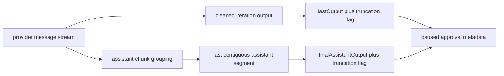

# PRD: Paused Snapshot Contract Design

## 1. Problem Statement

Archon's paused approval snapshot currently exposes one compatibility field,
`lastOutput`, which is a bounded copy of accumulated node output at pause time.
That is useful for basic parity, but it does not reliably answer the operator's
real question: what did the assistant conclude right before asking me to
approve or respond?

The gap is strongest in interactive loops and approval flows that include tool
use. The executor already knows the streamed assistant and tool sequence for the
paused iteration, but the stored snapshot collapses that sequence into a single
string. When the iteration is long, tool-heavy, or truncated, the operator gets
bulk transcript instead of the assistant's closing summary.

Slice 2 defines an additive paused-snapshot contract that keeps `lastOutput`
for compatibility while adding a more semantic `finalAssistantOutput` field.

## 2. Source Context

Umbrella plan:

- `docs/plans/archon-paused-output-ux-parity_plan.md`

Active slice only:

- Slice 2: Paused Snapshot Contract Design

This PRD is the only intended implementation input for Slice 2. The umbrella
plan remains context, not execution scope.

## 3. Current Verified Behavior

- `packages/providers/src/types.ts` models assistant output as streamed
  `MessageChunk` entries of type `assistant`, not as a pre-grouped semantic
  "final answer" turn.
- `packages/workflows/src/dag-executor.ts` interactive loops accumulate
  `fullOutput` and `cleanOutput`, then store `lastIterationOutput =
  cleanOutput || fullOutput`.
- `packages/workflows/src/dag-executor.ts` `toApprovalLastOutput()` trims that
  string, bounds it to 8000 characters, and appends `\n\n[truncated]` when
  clipped.
- `packages/workflows/src/schemas/workflow-run.ts`,
  `packages/workflows/src/event-emitter.ts`, and
  `packages/server/src/adapters/web/workflow-bridge.ts` currently expose only
  `lastOutput` on paused approval metadata and SSE status payloads.
- Existing executor coverage proves only that large `lastOutput` is bounded
  before pause; it does not prove coexistence between a long compatibility
  snapshot and a shorter semantic final output.

## 4. Users And Job To Be Done

Primary user: Mase as the operator of paused Archon workflows in Web or CLI.

Job to be done:

> When a workflow pauses after a long or tool-heavy iteration, I want the pause
> snapshot to preserve the full compatibility output and also expose the
> assistant's closing message, so I can decide quickly without reading the
> whole transcript.

## 5. Design Decision

### Recommendation

Define `finalAssistantOutput` as:

> the last contiguous assistant text segment whose content occurs after the
> most recent tool activity in the paused iteration, normalized for display by
> stripping completion tags and trimming surrounding whitespace.

Plain language:

- keep `lastOutput` as the broad "what happened this iteration" snapshot
- add `finalAssistantOutput` as the assistant's closing narrative after the
  last tool activity
- if no closing assistant text exists after the last tool call, omit
  `finalAssistantOutput` instead of inventing one

This recommendation corresponds to candidate 2: the last tool-free assistant
turn.

### Why This Definition

- It is semantic, not arbitrary. It captures the assistant's closing answer,
  not the tail of a long transcript.
- It is implementable from the executor's existing streamed message sequence.
- It stays provider-neutral because the normalized Archon message contract
  already distinguishes `assistant` chunks from `tool` and `tool_result`
  chunks.
- It is additive. Existing consumers can keep using `lastOutput`.
- It avoids prompt-contract coupling. Workflows do not need a new mandatory
  structured output block.

## 6. Alternatives Considered

### 1. The last assistant event in an iteration

Reject.

Reason:

- An assistant event is only a streamed text chunk, not a semantic turn.
- Using the last event would often capture only the last fragment of a sentence
  or paragraph.
- This definition is too transport-shaped to be product-meaningful.

### 2. The last tool-free assistant turn

Recommend.

Reason:

- This is the closest generic approximation of "the assistant's conclusion"
  without changing workflow prompts.
- It works for interactive loops and approval re-pause flows.
- It remains absent when the runtime genuinely has no closing narrative, which
  is more honest than synthesizing one.

### 3. The tail of the cleaned iteration output

Do not use as the primary definition.

Reason:

- Tail extraction is arbitrary and can still land in log noise, repeated tool
  explanation, or an incomplete clipped paragraph.
- It produces a substring, not a semantic boundary.
- It may be acceptable as a future emergency fallback, but that belongs with
  broader full-output and fallback work, not the primary contract.

### 4. A structured output block explicitly emitted by the workflow prompt

Reject for Slice 2.

Reason:

- This would couple the paused snapshot contract to workflow prompt authoring
  and prompt discipline across workflows.
- It widens the slice into prompt-protocol design and migration work.
- It is better treated as a future opt-in enhancement if generic closing-turn
  extraction proves insufficient.

## 7. Proposed Contract

The paused approval payload remains additive and backward-compatible.

```ts
approval: {
  nodeId: string;
  message: string;
  lastOutput?: string;
  lastOutputTruncated?: boolean;
  finalAssistantOutput?: string;
  finalAssistantOutputTruncated?: boolean;
  type?: 'approval' | 'interactive_loop';
  iteration?: number;
  sessionId?: string;
  completeOnUserInput?: string[];
  captureResponse?: boolean;
  onRejectPrompt?: string;
  onRejectMaxAttempts?: number;
}
```

Contract rules:

- `lastOutput` stays in place for compatibility.
- `lastOutput` continues to mean the bounded cleaned iteration output used
  today.
- Whenever `lastOutput` is present, `lastOutputTruncated` must also be present
  as an explicit boolean. `false` must be serialized when `lastOutput` is not
  clipped; omission must not be used to imply "not truncated."
- Existing `[truncated]` suffix behavior remains temporarily on `lastOutput`
  in Slice 2 for backward compatibility, but the typed boolean is the
  authoritative indicator once present.
- `finalAssistantOutput` means the last contiguous assistant-authored text
  segment selected after anchoring on the most recent tool activity in the
  paused iteration.
- Whenever `finalAssistantOutput` is present,
  `finalAssistantOutputTruncated` must also be present as an explicit boolean.
  `false` must be serialized when `finalAssistantOutput` is not clipped;
  omission must not be used to imply "not truncated."
- `finalAssistantOutput` uses the same character cap as `lastOutput` in
  Slice 2.
- If the paused iteration has no assistant-authored text after the final tool
  activity, omit `finalAssistantOutput`.
- If the iteration never invoked a tool, `finalAssistantOutput` may equal the
  iteration's final assistant response, even if that is also most of
  `lastOutput`.

## 8. Normalization Rules

For `finalAssistantOutput`:

- only `assistant` chunks participate in assistant-segment accumulation
- any non-`assistant` chunk breaks the current assistant segment
- only `tool` chunks determine the anchor for "after the most recent tool
  activity" when selecting the final segment
- `tool_result`, `thinking`, `system`, `result`, and `rate_limit` chunks are
  not included in `finalAssistantOutput`
- if no `tool` chunk exists in the paused iteration, select the final
  contiguous assistant segment of the iteration
- strip completion tags the same way loop display output is cleaned today
- trim whitespace before persistence
- apply the same bounded-snapshot cap used for `lastOutput`
- persist only when the normalized value is non-empty

For `lastOutput`:

- preserve current cleaned-output semantics for compatibility
- keep the temporary `[truncated]` suffix in Slice 2 when clipping occurs
- do not redefine it to mean "final answer"

## 9. Flow Diagram



## 10. Acceptance Criteria

- The Slice 2 implementation keeps `approval.lastOutput` unchanged as a
  compatibility field.
- The paused approval contract adds typed truncation metadata for
  `lastOutput`.
- The paused approval contract adds optional `finalAssistantOutput` and
  `finalAssistantOutputTruncated` fields.
- Whenever `lastOutput` is present, `lastOutputTruncated` is also present as
  an explicit boolean.
- Whenever `finalAssistantOutput` is present,
  `finalAssistantOutputTruncated` is also present as an explicit boolean.
- `finalAssistantOutput` is derived from the last contiguous assistant text
  segment after the most recent tool activity in the paused iteration.
- Any non-`assistant` chunk breaks assistant segment grouping, but only `tool`
  activity changes the selection anchor for which segment counts as final.
- If the paused iteration has no assistant text after the last tool activity,
  `finalAssistantOutput` is omitted.
- Existing pause behavior for approval nodes without preceding assistant output
  remains valid; those pauses may legitimately omit `finalAssistantOutput`.
- Tests prove that a long cleaned iteration output can coexist with a shorter,
  useful `finalAssistantOutput`.
- Tests prove that typed truncation flags reflect clipping without requiring
  consumers to parse `[truncated]`.
- `finalAssistantOutput` uses the same character cap as `lastOutput` in
  Slice 2.

## 11. Required Test Coverage

Executor tests should cover at least:

1. Interactive loop, long tool-heavy iteration, concise closing summary:
   - `lastOutput` contains the long cleaned iteration snapshot
   - `lastOutputTruncated === true` when clipped
   - `finalAssistantOutput` contains the short closing summary
   - `finalAssistantOutputTruncated === false`
2. Interactive loop, no tool use:
   - `finalAssistantOutput` equals the final assistant response for the
     iteration
   - `lastOutput` remains present
3. Interactive loop, tool use but no assistant text after the last tool:
   - `lastOutput` remains present
   - `finalAssistantOutput` is omitted
4. Approval node re-pause via `on_reject` prompt:
   - `finalAssistantOutput` follows the same extraction rule as interactive
     loops
5. SSE or API contract coverage:
   - added fields serialize cleanly without breaking existing paused payload
     consumers
6. Segment-boundary behavior:
   - `assistant` chunks join only when contiguous
   - `thinking`, `system`, `result`, `rate_limit`, or `tool_result` chunks
     break assistant grouping but do not count as assistant content
   - only `tool` chunks reset the "after the most recent tool activity"
     anchor used to choose the final assistant segment

## 12. Constraints And Dependencies

- The extraction logic must use Archon's normalized provider message stream, not
  provider-specific raw SDK events.
- The design must remain additive so Slice 1 Web behavior keeps working during
  migration.
- This slice should not require run-log reads, full transcript storage, or new
  prompt instructions.
- If typed truncation booleans are introduced, downstream consumers must not be
  forced to infer truncation from suffix parsing alone.

## 13. Risks

- Provider event-shape risk: assistant output is streamed in chunks, so segment
  grouping must be deterministic.
- Semantic gap risk: some workflows may end tool use without a final assistant
  summary, leaving `finalAssistantOutput` empty by design.
- Compatibility risk: mixed consumers may temporarily read suffix-based
  truncation while newer surfaces read booleans.
- Scope creep risk: trying to solve fallback, metadata cleanup, or adapter
  parity in the same implementation would blur this slice boundary.

## 14. Non-Scope

Do not include in Slice 2:

- code implementation in this PRD-authoring session
- Slice 3 runtime metadata hygiene
- Slice 4 full output fallback or run-log retrieval
- Slice 5 non-Web adapter behavior
- mandatory prompt-emitted structured summary blocks
- redesign of paused UI presentation beyond what future consumers need to read
  the additive contract

## 15. Workflow Handoff

### Planning Shape Recommendation

Single focused plan.

Rationale:

- The implementation is one bounded contract slice centered on executor pause
  metadata and its immediate typed surfaces.
- It is cross-package work, but still narrow enough to run as one focused PIV
  slice after approval.

### Eventual Implementation Recommendation

Yes. After this PRD is approved, the implementation should use
`archon-piv-loop-codex`.

Conditions:

- use this PRD as the execution input, not the umbrella plan
- reuse branch `archon/task-piv-paused-output-web-parity-v2`
- reuse worktree
  `/Users/mase/.archon/worktrees/Personal-Projects/Archon/archon/task-piv-paused-output-web-parity-v2`
- keep Slices 3 through 5 out of scope

### Operator Handoff Prompt

```text
Use archon-piv-loop-codex for Slice 2 only.

Execution input:
- PRD: docs/prd/paused-snapshot-contract-design.prd.md

Lane requirements:
- reuse branch archon/task-piv-paused-output-web-parity-v2
- reuse worktree /Users/mase/.archon/worktrees/Personal-Projects/Archon/archon/task-piv-paused-output-web-parity-v2
- do not implement from the umbrella plan
- keep Slice 3, Slice 4, and Slice 5 out of scope

Implementation goal:
- preserve approval.lastOutput for compatibility
- add typed truncation flags
- add finalAssistantOutput using the last tool-free assistant turn contract
- add executor and contract tests proving long lastOutput can coexist with a
  shorter semantic finalAssistantOutput

Stop after Slice 2 implementation and validation. Report exact files, tests,
and residual risks.
```

## 16. Open Questions

### Blocking

None.

### Non-Blocking

None. This PRD resolves the remaining Slice 2 clarifications as follows:

- `finalAssistantOutput` uses the same character cap as `lastOutput`.
- `lastOutput` keeps the temporary `[truncated]` suffix in Slice 2 for
  backward compatibility while the typed truncation booleans become the
  authoritative contract.
