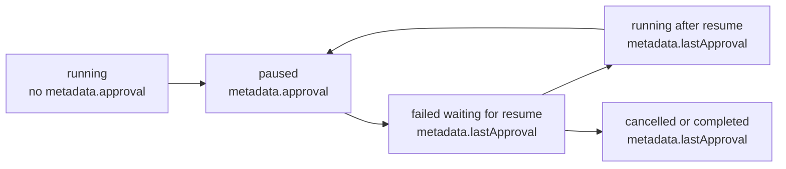

# PRD: Runtime Metadata Hygiene

## 1. Problem Statement

Archon's paused-workflow contract currently leaves `metadata.approval` in place
after a run stops being paused.

Verified current behavior:

- pause writes the live approval blob into `metadata.approval`
- approve and reject paths merge decision metadata into the same row
- resume flips the row back to `running` without clearing the old approval blob

That means a run can be `failed`-for-resume or `running` while still carrying a
metadata shape that looks like an active pause. Slice 3 fixes that runtime
state contract. It does not change paused-output snapshot extraction, full log
fallback, or non-Web adapter behavior.

## 2. Source Context

Umbrella plan:

- `docs/plans/archon-paused-output-ux-parity_plan.md`

Active slice only:

- Slice 3: Runtime Metadata Hygiene

This PRD is the only intended implementation input for Slice 3. The umbrella
plan remains context, not execution scope.

## 3. Current Verified Behavior

- `packages/workflows/src/schemas/workflow-run.ts` defines workflow status as
  `pending | running | completed | failed | cancelled | paused`, with only
  `failed` and `paused` treated as resumable states.
- `packages/workflows/src/schemas/workflow-run.ts` models
  `ApprovalContext` as the live paused gate payload under `metadata.approval`,
  including `nodeId`, `message`, pause snapshots, loop iteration/session
  fields, and reject-handling fields.
- `packages/core/src/db/workflows.ts` `pauseWorkflowRun()` transitions a run
  from `running` to `paused` and merges `{ approval: approvalContext }` into
  `metadata`.
- `packages/core/src/db/workflows.ts` `updateWorkflowRun()` merges metadata; it
  does not support deleting `metadata.approval`.
- `packages/core/src/operations/workflow-operations.ts` approval and rejection
  paths intentionally keep approval context alive today because resumed
  interactive loops and reject-resume flows rely on it.
- `packages/core/src/db/workflows.ts` `resumeWorkflowRun()` sets status back to
  `running` and refreshes timestamps, but does not mutate `metadata`.
- `packages/cli/src/commands/workflow.ts` only renders `Latest output` when
  `run.status === "paused"`.
- `packages/server/src/adapters/web/workflow-bridge.ts` emits approval payloads
  only on `approval_pending`.
- `packages/web/src/stores/workflow-store.ts` only stores `approval` on paused
  status events, so current UI behavior already treats status as authoritative.

The runtime row contract is still misleading, though, because the persisted
database record can carry a live-looking `metadata.approval` blob after pause
resolution.

## 4. Users And Job To Be Done

Primary user: Mase as the operator of paused Archon workflows in Web and CLI.

Job to be done:

> When a workflow leaves a pause gate, I want the runtime metadata to stop
> looking paused immediately, while resume logic still has enough context to
> continue correctly and operators still have a compact audit trail.

## 5. Design Decision

### Recommendation

Adopt a two-surface metadata contract:

- `metadata.approval` is a live pause payload only and must exist only while
  `status === "paused"`
- `metadata.lastApproval` stores the latest resolved pause in a non-actionable,
  audit-safe shape that resume logic may still read when continuing the run

This recommendation combines candidate 2 and candidate 3:

- preserve the latest approval history under `metadata.lastApproval`
- keep it explicitly non-live so it cannot be mistaken for a current pause

### Why This Decision

- It keeps one unambiguous pause rule: `status === "paused"` is the only
  actionable pause signal.
- It removes the misleading persisted shape without throwing away resume
  context that interactive loops and reject-resume flows still need.
- It preserves a compact audit/debug record without widening the slice into a
  full approval-history system.
- It matches the current UI direction, where paused state is already gated on
  status rather than on raw metadata presence.

## 6. Proposed Runtime Metadata Contract

### Live Pause

`metadata.approval` keeps its current role, but its lifetime becomes strict:

```ts
approval?: {
  nodeId: string;
  message: string;
  lastOutput?: string;
  lastOutputTruncated?: boolean;
  finalAssistantOutput?: string;
  finalAssistantOutputTruncated?: boolean;
  type?: 'approval' | 'interactive_loop';
  iteration?: number;
  sessionId?: string;
  completeOnUserInput?: string[];
  captureResponse?: boolean;
  onRejectPrompt?: string;
  onRejectMaxAttempts?: number;
};
```

Rule:

- `metadata.approval` must be present only when `status === "paused"`

### Resolved Pause

Add a new latest-history field:

```ts
lastApproval?: {
  nodeId: string;
  message: string;
  type: 'approval' | 'interactive_loop';
  iteration?: number;
  sessionId?: string;
  completeOnUserInput?: string[];
  captureResponse?: boolean;
  onRejectPrompt?: string;
  onRejectMaxAttempts?: number;
  lastOutput?: string;
  lastOutputTruncated?: boolean;
  finalAssistantOutput?: string;
  finalAssistantOutputTruncated?: boolean;
  resolution: 'approved' | 'rejected';
  decisionText?: string;
  resolvedAt: string;
  resumedAt?: string;
};
```

Rules:

- `metadata.lastApproval` is the latest resolved gate only; full history
  continues to live in workflow events
- `metadata.lastApproval` may remain present on `failed`, `running`,
  `completed`, or `cancelled` runs
- UI and API pause rendering must never treat `metadata.lastApproval` as a live
  pause signal
- resume logic for approval nodes and interactive loops may read
  `metadata.lastApproval` after a decision is recorded

### Root-Level Resume Fields

Keep the existing root metadata fields that drive resume behavior:

- `approval_response`
- `loop_user_input`
- `loop_completion_input`
- `rejection_reason`
- `rejection_count`

Slice 3 changes where the gate context lives, not the meaning of those
decision/result fields.

## 7. Lifecycle Rules

### Pause

- status becomes `paused`
- `metadata.approval` is written with the live gate context
- `metadata.lastApproval` is unchanged

### Approve Or Reject

- status becomes resumable `failed` where that is the current workflow control
  path
- the live `metadata.approval` payload is copied into `metadata.lastApproval`
  together with the decision and `resolvedAt`
- `metadata.approval` is removed from the row
- current decision fields such as `loop_user_input` or `rejection_reason`
  remain written at the metadata root as they are today

### Resume

- status becomes `running`
- `metadata.approval` remains absent
- `metadata.lastApproval` remains available for audit/debug and may receive
  `resumedAt`

### Re-Pause

- a new live `metadata.approval` payload is written for the new pause
- `metadata.lastApproval` continues to represent the latest resolved gate until
  the new gate is resolved

### Terminal States

- `completed` and `cancelled` runs must not carry `metadata.approval`
- `metadata.lastApproval` may remain as the latest resolved gate snapshot

## 8. State Diagram



## 9. Alternatives Considered

### 1. Clear `metadata.approval` only on resume

Reject.

Reason:

- the run still carries live-looking approval metadata during the intermediate
  resumable `failed` state
- current resume paths need gate context before the runner flips back to
  `running`

### 2. Keep using `metadata.approval` everywhere and rely on status checks

Reject.

Reason:

- it leaves a persistent footgun in the database contract
- future UI, API, or tooling can still misread raw metadata without strong
  gating
- it does not make the runtime state self-describing

### 3. Preserve all approval history in metadata arrays

Reject for Slice 3.

Reason:

- it widens scope into full approval-history design
- workflow events already exist as the detailed audit trail
- a single `lastApproval` snapshot is enough for resume/debug needs in this
  slice

### 4. Clear `metadata.approval` and move the latest resolved gate to
`metadata.lastApproval`

Recommend.

Reason:

- it preserves resume-safe context without keeping a live-looking pause blob in
  non-paused rows
- it keeps the contract small and operator-readable
- it separates active state from historical state cleanly

## 10. Acceptance Criteria

- `status === "paused"` is the only actionable pause signal in runtime state.
- Paused runs persist `metadata.approval` with the live gate context.
- `running`, `failed`, `completed`, and `cancelled` runs do not persist
  `metadata.approval`.
- Approving a standard approval node still resumes correctly after the gate
  context moves out of `metadata.approval`.
- Rejecting an approval node with `on_reject` still resumes correctly after the
  gate context moves out of `metadata.approval`.
- Approving an interactive loop with ordinary feedback still resumes the next
  iteration correctly.
- Approving an interactive loop with a completion alias still completes the
  loop correctly.
- The latest resolved gate is preserved in `metadata.lastApproval` with
  decision metadata and enough context for audit/debug.
- Workflow events remain the detailed history surface; Slice 3 does not require
  a full metadata approval-history array.
- Web/CLI/API pause rendering does not treat non-paused rows as live pauses.

## 11. Test Plan

Use existing test homes and keep coverage scoped to the contract change:

- `packages/core/src/db/workflows.test.ts`
  - verify cross-dialect metadata mutation can remove `approval` and write
    `lastApproval`
  - verify `resumeWorkflowRun()` does not resurrect a live `approval` blob
- `packages/core/src/operations/workflow-operations.test.ts`
  - approval-gate approve path archives `lastApproval` and clears `approval`
  - interactive-loop approve path archives `lastApproval` and preserves resume
    inputs
  - reject-with-on_reject path archives `lastApproval` and preserves rejection
    state
- `packages/server/src/routes/api.workflow-runs.test.ts`
  - API approve/reject handlers return correct behavior after the contract
    change
  - non-paused run payloads no longer expose live `metadata.approval`
- `packages/workflows/src/dag-executor.test.ts`
  - interactive-loop resume still restores iteration/session state from the
    resolved gate snapshot
  - approval-node reject resume still finds the correct node context
- `packages/web/src/stores/workflow-store.test.ts`
  - paused status stores approval context
  - running/failed status clears any active approval context and does not
    rebuild it from historical metadata

Implementation validation:

```bash
bun run type-check
bun run lint
bun test packages/core/src/db/workflows.test.ts
bun test packages/core/src/operations/workflow-operations.test.ts
bun test packages/server/src/routes/api.workflow-runs.test.ts
bun test packages/workflows/src/dag-executor.test.ts
bun test packages/web/src/stores/workflow-store.test.ts
```

Before merge or PR:

```bash
bun run validate
```

## 12. Risks And Implementation Notes

- Current database helpers support JSON merge but not JSON key deletion. Slice 3
  likely needs a new cross-dialect metadata-removal path or a safe
  read-modify-write replacement helper.
- Interactive-loop and reject-resume logic currently depend on live approval
  metadata surviving into resumable states. Implementation must move those
  reads to `lastApproval` or an equivalent helper in the same slice, not later.
- The contract change crosses database state, operation helpers, executor
  resume logic, API exposure, and UI consumers. Partial adoption will create
  inconsistent behavior.
- Historical rows already carrying stale `metadata.approval` may still exist.
  This slice should define whether they are tolerated as legacy data or cleaned
  opportunistically, but it should not widen into a large migration project.

## 13. Non-Scope

Do not include:

- Slice 4 full paused-output fallback
- Slice 5 non-Web adapter review or implementation
- changes to Slice 2 paused snapshot extraction semantics
- broad workflow event redesign
- multi-entry approval history arrays in metadata
- PR structure or base-branch changes
- direct implementation from the umbrella plan

## 14. Operator Handoff

Recommended next implementation lane after PRD approval:

- yes, use `archon-piv-loop-codex`

Operator rules for that follow-up run:

- use this PRD as the only implementation scope input
- do not feed the umbrella plan into the PIV implementation run
- keep Slice 4 and Slice 5 out of scope
- reuse branch `codex/paused-output-slices-1-2-review`
- prefer the existing review worktree at `/tmp/archon-paused-output-review`
  instead of creating a new auto-generated Archon branch/worktree
- pause again for human review after implementation validation

This PRD draft is the checkpoint for human review. Do not implement Slice 3 in
this session.
