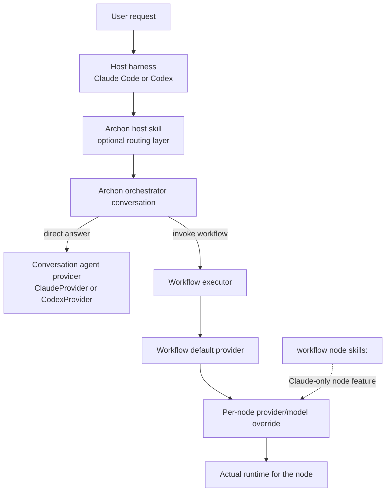

This document explains the full assistant-selection stack in Archon.

It exists to answer questions like:

- What does "Codex-driven repo" actually mean?
- How is that different from workflow `provider: codex`?
- What is the difference between an Archon skill and workflow-node `skills:`?
- Which parts are standard upstream Archon, and which parts are specific to this fork?
- Which nodes can run on Codex today, and what breaks or degrades?

## Executive Summary

Archon has multiple independent selection layers:

1. **Host harness layer**: Claude Code or Codex is the outer tool you are using to invoke Archon.
2. **Conversation/orchestrator layer**: Archon stores an assistant type on codebases and conversations. That decides whether the top-level Archon conversation runs through the Claude client or the Codex client.
3. **Workflow default provider layer**: When a workflow runs, Archon resolves a default provider for the workflow from workflow YAML or merged config.
4. **Per-node provider/model layer**: Individual AI nodes can override provider and model again.

Those layers are related, but they are not the same setting.

## Mental Model



The critical point is that the workflow executor can choose a provider that is different from the top-level conversation assistant.

## Layer 1: Host Harness

This is the outer coding agent you are currently running:

- Claude Code
- Codex

At this layer, Archon can be exposed through a **host skill** that teaches the outer agent how to call Archon workflows and how to route requests.

In this repo today:

- Claude-oriented host skill: `.claude/skills/archon/`
- Codex-oriented host skill: `.agents/skills/archon/`

These two paths exist because Claude and Codex discover different host-skill
roots. In this fork, they are intended to be mirrored copies of the same
Archon skill content rather than separately maintained skill variants. See
[Host Skill Mirroring](/reference/host-skill-mirroring/) for the maintenance
rule.

This layer is about **how the outer assistant learns to use Archon**. It does **not** decide how workflow nodes run once Archon is executing them.

## Layer 2: Conversation And Orchestrator Assistant

Archon stores `ai_assistant_type` on codebases and conversations in the database. That value determines which top-level assistant client powers the Archon conversation.

What it affects:

- direct chat answers from Archon
- top-level orchestration and routing
- which default "assist" workflow the orchestrator suggests when routing is unclear

What it does not automatically affect:

- the provider used by every workflow node

### How conversation assistant type is chosen

At conversation creation time, Archon uses this order:

1. existing conversation value if conversation already exists
2. parent conversation assistant type when inheriting context
3. codebase `ai_assistant_type` from the database when a codebase is attached
4. `DEFAULT_AI_ASSISTANT` env var
5. built-in default `claude`

Important implementation detail:

- the codebase `ai_assistant_type` is currently set when the repo is registered
- registration auto-detects `codex` if a `.codex/` folder exists, otherwise `claude` if a `.claude/` folder exists
- repo `.archon/config.yaml` does **not** currently write back into `remote_agent_codebases.ai_assistant_type`

So "this repo is Codex-driven in the database" means:

- the **top-level Archon conversation** for that codebase will use Codex by default
- it does **not** guarantee that every workflow node runs on Codex

## Layer 3: Workflow Default Provider

When a workflow starts, Archon resolves a default provider for the workflow separately from the conversation assistant.

Resolution order:

1. workflow `provider`
2. infer provider from workflow `model`
3. merged config `assistant`
4. built-in default `claude`

The merged config order is:

1. built-in defaults
2. `~/.archon/config.yaml`
3. repo `.archon/config.yaml`
4. environment variables

That means a workflow can run on:

- Claude even when the top-level conversation is Codex
- Codex even when the top-level conversation is Claude

This is the main reason the system can feel confusing if you think there is only one "assistant" switch.

## Layer 4: Per-Node Provider And Model

For AI nodes, Archon resolves provider and model again at node execution time.

Current resolution order for a command or prompt node:

1. node `provider`
2. infer provider from node `model`
3. workflow default provider

Model resolution:

1. node `model`
2. workflow model if provider matches workflow provider
3. config default model for that provider

This means a single workflow can mix:

- mostly Claude nodes with a few Codex nodes
- mostly Codex nodes with a few Claude nodes

provided those nodes do not rely on features unsupported by the chosen provider.

## Two Different Meanings Of "Skills"

This is a major source of confusion.

### Host skill

Examples:

- `.claude/skills/archon/SKILL.md`
- `.agents/skills/archon/SKILL.md`

Purpose:

- teach the outer assistant how to use Archon
- route a request into the correct Archon workflow
- explain conventions like branch naming and workflow selection

This is **outside** the workflow engine.

### Workflow-node `skills:`

Example in workflow YAML:

```yaml
nodes:
  - id: review
    prompt: "Review the implementation"
    skills:
      - code-review
```

Purpose:

- preload domain-specific knowledge into a workflow node
- currently implemented using Claude Agent SDK agent definitions

This is a **workflow node feature**, not a host-routing feature.

Current behavior:

- supported for Claude nodes
- ignored with warnings for Codex nodes

## Node Types And Assistant Relevance

Not every node type depends on Claude or Codex.

| Node type | Uses AI provider? | Notes |
| --- | --- | --- |
| `command` | Yes | Named markdown prompt file loaded, then executed by Claude or Codex |
| `prompt` | Yes | Inline AI prompt executed by Claude or Codex |
| `loop` | Yes | Iterative AI execution; special runtime path |
| `bash` | No | Shell only |
| `script` | No | `bun` or `uv` runtime only |
| `approval` | No AI execution of its own | Human gate |
| `cancel` | No | Terminates workflow |

So the real Codex/Claude compatibility question applies primarily to `command`, `prompt`, and `loop` nodes.

## Codex Compatibility By Node Type

### Command and prompt nodes

These are the best candidates for Codex.

They can run on Codex if they rely only on:

- prompt text
- repository access
- shell/file/git/network capabilities provided by Codex
- `output_format`

They should **not** rely on Claude-only node features listed later in this document.

### Loop nodes

Current code supports loop-node provider/model selection, but the docs still say otherwise.

Actual current behavior:

- loop nodes do resolve `provider` and `model`
- loop nodes can therefore run on Codex
- loop nodes still do **not** support most of the richer Claude-only node features

This is a load-bearing doc/code mismatch. Treat the implementation as authoritative until docs are corrected.

### Bash/script/approval/cancel nodes

These are provider-agnostic. They can exist in a Codex-oriented workflow because they do not call either AI assistant directly.

## Exact Codex Limitations For Workflow Nodes

### Supported on Codex nodes

Supported today:

- `provider: codex`
- `model: <openai-model>`
- `output_format`
- Codex tuning inputs:
  - workflow-level `modelReasoningEffort`
  - workflow-level `webSearchMode`
  - workflow-level `additionalDirectories`
  - command/prompt-node `modelReasoningEffort`
  - config fallback from `assistants.codex.model`, `assistants.codex.modelReasoningEffort`, `assistants.codex.webSearchMode`, and `assistants.codex.additionalDirectories`

### Ignored with warnings on Codex command/prompt nodes

These features are currently Claude-only and are ignored on Codex nodes:

- `skills`
- `hooks`
- `mcp`
- `allowed_tools`
- `denied_tools`
- Claude advanced options:
  - `effort`
  - `thinking`
  - `maxBudgetUsd`
  - `systemPrompt`
  - `fallbackModel`
  - `betas`
  - `sandbox`

### Loop-node limitations

Loop nodes have a separate limitation set.

Current implementation:

- `provider` and `model` do work for loop nodes
- node-level `modelReasoningEffort` does **not** affect loop execution
- these still do **not** apply to loop iterations:
  - node-level `modelReasoningEffort`
  - `hooks`
  - `mcp`
  - `skills`
  - `allowed_tools`
  - `denied_tools`
  - `output_format`

Loop nodes still use workflow/config-level Codex tuning only. This slice does not add loop-node reasoning parity.

### Codex tuning precedence

Codex tuning is split between workflow defaults and a narrow node-level override:

- workflow-level `modelReasoningEffort`
- workflow-level `webSearchMode`
- workflow-level `additionalDirectories`
- command/prompt-node `modelReasoningEffort`

Practical effect:

- `model:` on a workflow is effective
- on `command` and `prompt` nodes, `modelReasoningEffort` resolves as `node > workflow > assistants.codex.*`
- `webSearchMode` and `additionalDirectories` remain workflow-level only and resolve as `workflow > assistants.codex.*`
- if workflow YAML omits those fields, execution falls back to `assistants.codex.*`

Current precedence is:

1. command/prompt node `modelReasoningEffort` for reasoning only
2. workflow YAML
3. `assistants.codex.*` in Archon config
4. SDK defaults

## When Codex Can Realistically Replace Claude For A Node

A node is a good candidate for Codex when all of these are true:

1. it is a `command`, `prompt`, or simple `loop` node
2. it does not depend on `skills`, `hooks`, `mcp`, or tool restriction fields
3. it does not depend on Claude-only advanced options
4. the prompt is generic and does not assume Claude-specific behavior
5. the required tools are available through Codex's own runtime setup

A node is **not** a good candidate for Codex when it depends on:

- Claude skill injection
- Claude hook behavior
- per-node MCP wiring
- Claude-specific system-prompt or thinking controls

## Upstream vs This Fork

### Standard upstream implementation

Upstream Archon already supports the broad architecture:

- Claude and Codex are both first-class assistant providers
- workflow YAML supports `provider` and `model`
- workflow nodes can select provider and model
- config supports both Claude and Codex defaults
- conversation/orchestrator assistant selection exists

Upstream public docs also already describe:

- Codex as an AI assistant
- per-node `provider` / `model`
- workflow-level Codex settings

### Fork-specific additions in this repo

This fork adds a more explicit Codex-facing routing surface.

Verified additions in this checkout:

1. **Codex-specific assist workflow**
   - `.archon/workflows/defaults/archon-assist-codex.yaml`
   - `.archon/commands/defaults/archon-assist-codex.md`

2. **Codex-specific host skill**
   - `.agents/skills/archon/SKILL.md`

3. **Docs updated to mention Codex-specific assist lane**
   - `archon-assist-codex` appears in the local docs and workflow catalog

### Fork-specific caveats

There are also fork-local inconsistencies worth knowing:

1. **The setup wizard now installs mirrored host-skill surfaces**
   - it copies the same Archon skill tree into `.claude/skills/archon/`
   - it also copies the mirrored tree into `.agents/skills/archon/`

2. **Two host-skill roots still exist**
   - Claude discovers `.claude/skills/archon/`
   - Codex discovers `.agents/skills/archon/`
   - the intent in this fork is to keep them mirrored, not divergent

3. **Repo-local workflow default is not pinned here**
   - this repo's `.archon/config.yaml` does not set `assistant:`
   - so workflow default provider for this repo depends on global config or environment unless a workflow sets its own provider

4. **JSON CLI surfaces still depend on quiet startup and discovery behavior**
   - `archon workflow list --json` is only truly machine-readable when startup
     and discovery logs stay off stdout

5. **Docs still understate some loop-node capabilities**
   - docs say loop-node `provider` / `model` are ignored
   - current code resolves them

## Practical Precedence Tables

### Conversation/orchestrator assistant

| Order | Source |
| --- | --- |
| 1 | existing conversation |
| 2 | parent conversation |
| 3 | codebase `ai_assistant_type` from DB |
| 4 | `DEFAULT_AI_ASSISTANT` |
| 5 | built-in default `claude` |

### Workflow default provider

| Order | Source |
| --- | --- |
| 1 | workflow `provider` |
| 2 | inferred from workflow `model` |
| 3 | merged config `assistant` |
| 4 | built-in default `claude` |

### Per-node provider

| Order | Source |
| --- | --- |
| 1 | node `provider` |
| 2 | inferred from node `model` |
| 3 | workflow default provider |

## Recommended Migration Strategy For Claude-To-Codex Workflow Changes

When converting a workflow or node from Claude to Codex:

1. start with `command` or `prompt` nodes
2. remove or replace `skills`, `hooks`, `mcp`, and tool restriction fields
3. keep the prompt generic
4. test one node at a time before converting the entire workflow
5. prefer a `-codex` workflow variant when behavior meaningfully diverges
6. keep Claude as the provider for nodes that truly depend on Claude-only features

This usually leads to a mixed-provider workflow rather than an all-or-nothing migration.

## Decision Checklist

Use this checklist before changing a node to Codex:

- Is this node AI-driven at all?
- Does it use `skills`, `hooks`, `mcp`, `allowed_tools`, or `denied_tools`?
- Does it rely on Claude-only advanced fields?
- Is the desired behavior actually controlled by the conversation assistant, the workflow default, or the node override?
- If the repo is "Codex-driven" only in the database, do we also want the workflow YAML or repo config to reflect that?

If you answer those questions first, the assistant-selection model becomes much less ambiguous.

## Verified Source Anchors

The implementation details in this document were verified against:

- `packages/core/src/db/conversations.ts`
- `packages/core/src/orchestrator/orchestrator-agent.ts`
- `packages/core/src/config/config-loader.ts`
- `packages/core/src/handlers/clone.ts`
- `packages/workflows/src/executor.ts`
- `packages/workflows/src/dag-executor.ts`
- `.agents/skills/archon/SKILL.md`
- `.archon/workflows/defaults/archon-assist-codex.yaml`
- `.archon/commands/defaults/archon-assist-codex.md`

And compared against upstream/public docs:

- `https://archon.diy/getting-started/ai-assistants/`
- `https://archon.diy/guides/authoring-workflows/`
- `https://archon.diy/guides/skills/`
- `https://archon.diy/book/essential-workflows/`
